<div align="center">
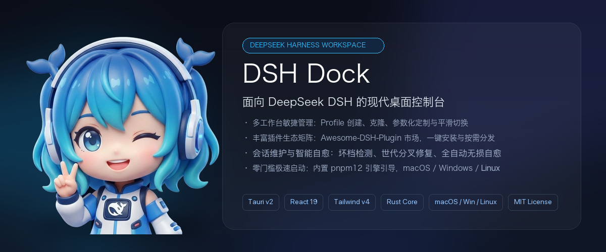

# DSH Dock

**专为 DeepSeek Harness (DSH) 打造的跨平台桌面控制中心**
<br />
*Desktop Control Center for DeepSeek Harness*

[](https://github.com/realguan/dsh-dock/releases)
[%20%7C%20Linux-3b82f6?style=flat-square)](https://github.com/realguan/dsh-dock/releases)
[](https://tauri.app)
[](https://react.dev)
[](https://www.npmjs.com/package/@deepseek-ai/dsh)
[](LICENSE)

<br />

> **"命令行留给极客，工作台交给 Dock。"**

<br />

[📥 下载安装](#-下载与安装) · [🎯 核心能力](#-核心能力) · [🖥️ 运行时与桌面集成](#️-运行时与桌面集成) · [⚡ 快速上手](#-快速上手) · [🏛️ 架构](#️-架构与设计原则) · [🗺️ 路线图](#️-路线图)

<br />

---

</div>

<br />

## 💡 什么是 DSH Dock？

[DSH](https://www.npmjs.com/package/@deepseek-ai/dsh)（DeepSeek Harness）是 DeepSeek 官方的智能体开发工具链，通过文件驱动架构与 Cordis 插件系统提供强大的 AI 编程和任务编排能力。

**DSH Dock** 是为 DSH 打造的**跨平台桌面客户端与独立控制中心**（基于 Tauri v2 + Rust + React 19），补齐官方 CLI 尚未提供的可视化管理体验：

- 🪶 **安装包 22 MB 起** — 各平台独立打包，内置 pnpm 引导器，不预装 Node.js 与 DSH
- 🛡️ **严守 Non-Fork 原则** — 不修改上游 DSH 任何源码，通过官方 CLI 规范与文件契约协同，与上游始终保持同步
- 🌐 **多语言界面** — 支持中文与 English，跟随系统语言自动切换
- ⚡ **开箱即用** — 无需预装 Node.js / pnpm / DSH，首次启动自动补齐
- 🖥️ **三平台覆盖** — macOS（Apple Silicon）、Windows（含 WSL2 穿透）、Linux（deb / rpm / AppImage）

<br />

---

## 🎯 核心能力

DSH Dock 的四个主模块与应用内导航一一对应，另有一层贯穿全局的壳层能力：

| 模块 | 应用内位置 | 解决什么 |
| :--- | :--- | :--- |
| **① 多工作台管理** | 控制中心 → `Profile 列表` | 工作台的创建、克隆、重命名、删除与启动 |
| **② 插件中心** | 控制中心 → `插件中心` | 3,400+ 社区插件的检索与安装 |
| **③ 会话维护** | 控制中心 → `会话维护` | 会话健康巡检与损坏自愈 |
| **④ 系统控制台** | 控制中心 → `系统控制台` | 凭据、引擎配置、健康诊断与运行日志 |
| **壳层能力** | 贯穿全局 | 运行时自举、托盘常驻、熔断守护、自动更新 |

<br />

### ① 控制中心 · 多工作台管理

官方 CLI 只提供 `--profile <name>` 启动与 `--from-default-profile <template>` 从模板派生（派生即启动），没有工作台的列举、重命名、克隆或删除命令。Dock 提供完整的可视化生命周期管理：

- **一览全局**：查看每个工作台的运行状态、默认启动标签与插件数量统计
- **安全克隆**：复制工作台时自动排除 `node_modules`，自动改写包名，保证物理隔离
- **运行防护**：运行中的工作台自动锁定，防止误删误改
- **默认工作台**：设定后下次启动直达常用工作流
- **官方转发**：新建工作台走 `dsh plugin` 官方 CLI 转发链，其余生命周期操作在文件层完成并严格遵循 dsh 的文件契约（不修改上游源码）

**启动中心（Launchpad）** 是进入应用后的第一站：多工作台时以卡片网格呈现全部工作台及其运行态、默认标签与插件数，点卡片或按数字键 `1-9` 直达，勾选「记住我的选择」则下次启动直接进入——不必再记 `--profile` 参数：

<div align="center">
  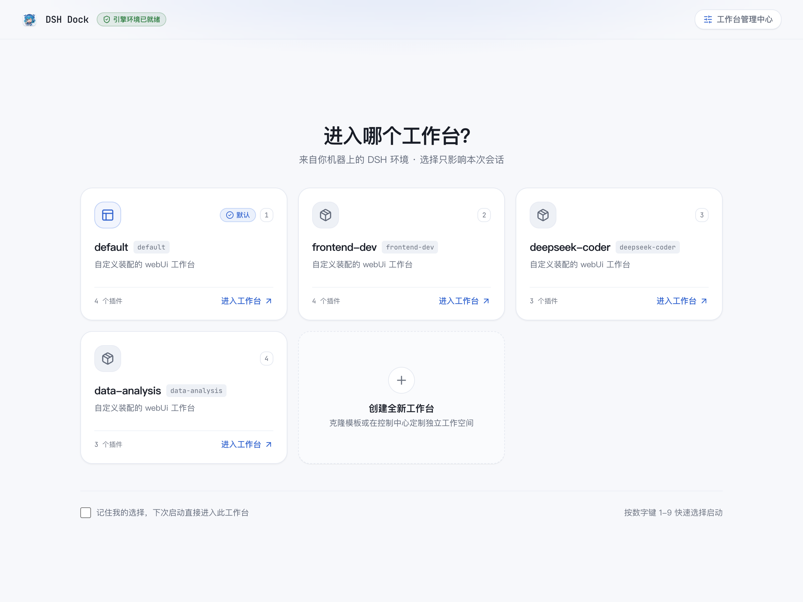
  <p><em>启动中心：多工作台卡片网格、数字键直达与「记住我的选择」</em></p>
</div>

<div align="center">
  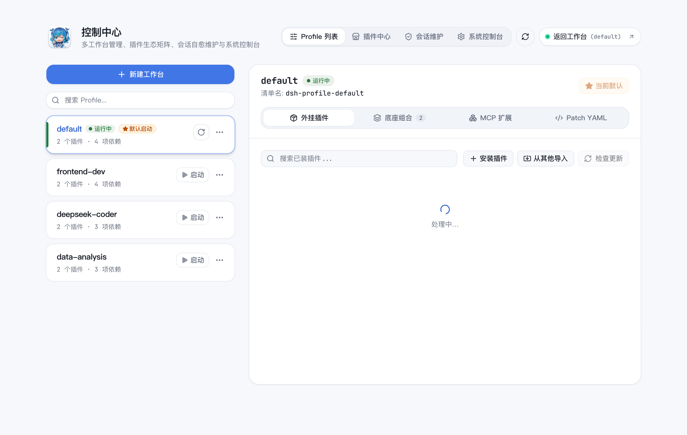
  <p><em>控制中心：左侧工作台列表（状态、默认标签、插件数），右侧详情面板</em></p>
</div>

<br />

#### 工作台生命周期管理

<table>
  <tr>
    <td width="50%" align="center">
      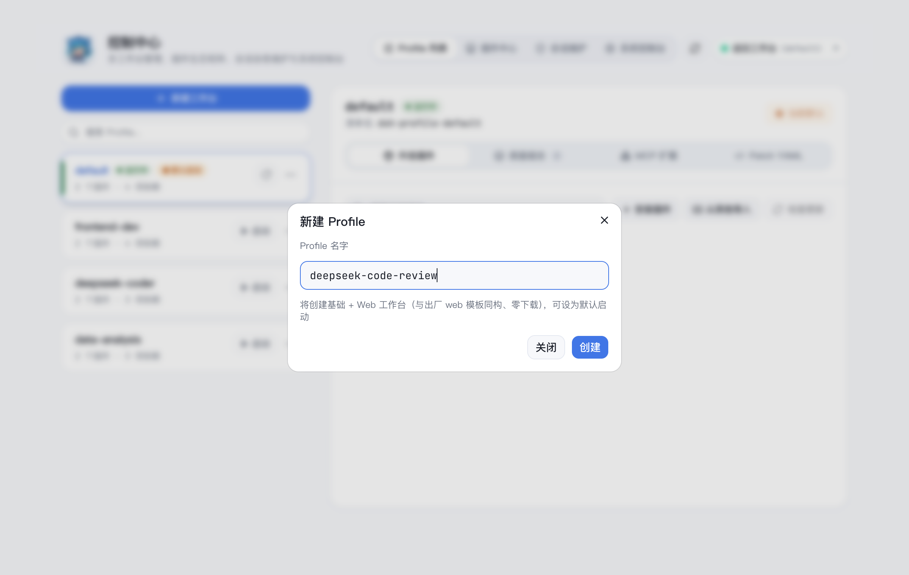
      <br />
      <strong>✨ 新建工作台</strong>
      <br />
      <sub>输入名称即可创建隔离工作台，自动初始化基础依赖</sub>
    </td>
    <td width="50%" align="center">
      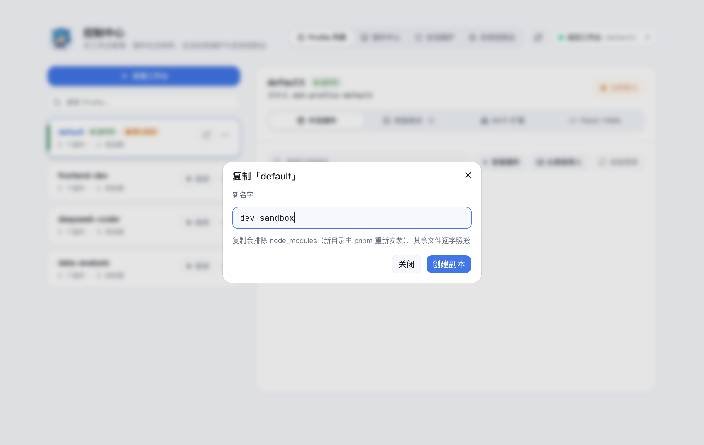
      <br />
      <strong>📋 安全克隆</strong>
      <br />
      <sub>排除 <code>node_modules</code>，一致化改写包名，物理隔离</sub>
    </td>
  </tr>
  <tr>
    <td colspan="2" align="center">
      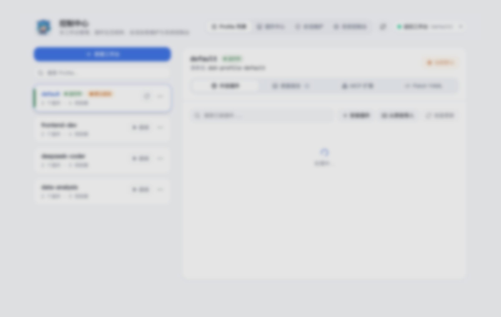
      <br />
      <strong>🛡️ 安全删除</strong>
      <br />
      <sub>运行中工作台自动锁定；删除时明确提示不影响全局历史会话</sub>
    </td>
  </tr>
</table>

<br />

#### 工作台详情面板

选中任一工作台后，右侧详情面板以 4 个 Tab 呈现其内部构成：

- **外挂插件**：该工作台已安装的第三方插件清单（含版本与说明）、实时运行态徽标、启停开关，以及安装 / 从其他工作台导入 / 检查更新入口
- **底座组合**：`dependencies` 与 `bundles` 依赖清单
- **MCP 扩展**：结构化配置该工作台的 Model Context Protocol 服务器
- **Patch YAML**：直接查看与复制 `cordis.patch.yml`

**外挂插件**是一屏看清"这个工作台装了什么、跑没跑起来"的地方——每行展示插件名、已装版本、运行态徽标与说明文字，并提供行内开关（禁用 / 启用，重启工作台后生效）、更新与卸载。工具栏汇聚了插件管理的三个入口：**安装插件**、**从其他工作台导入**、**检查更新**；点「检查更新」后有新版的行会浮出可点的新版本号，可查看全部可用版本后选择性升级：

<div align="center">
  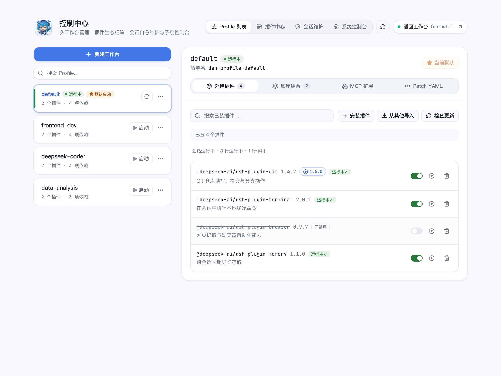
  <p><em>外挂插件：版本、运行态徽标（运行中 / 已禁用）、更新提示与行内开关</em></p>
</div>

其中的 **MCP 服务器管理器**支持结构化配置（command / args / env 环境变量）、单个启用或禁用，并内置 4 个常用预设（GitHub Tools、Filesystem Sandbox、PostgreSQL Database、Brave Web Search）一键套用：

<div align="center">
  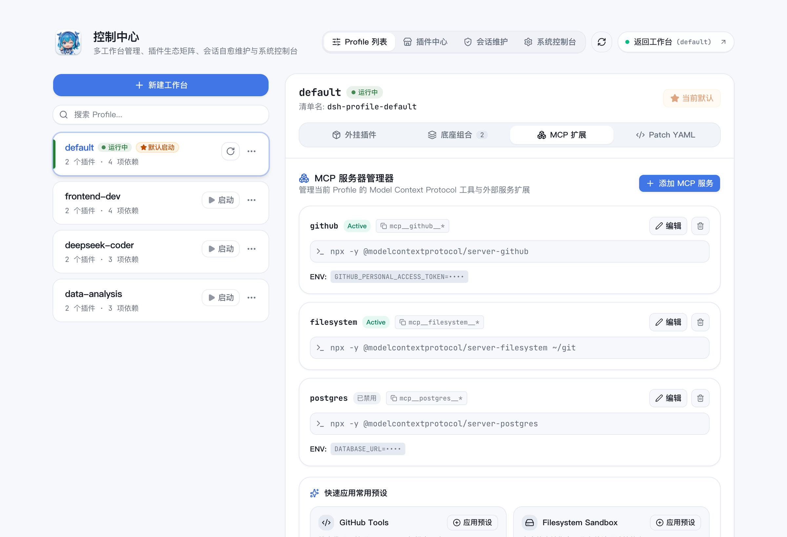
  <p><em>MCP 服务器管理器：结构化配置外部能力，常用预设一键应用</em></p>
</div>

<br />

### ② 插件中心 · 3,400+ 社区市场

官方 CLI 的 `dsh plugin add <package>` 要求你已知确切包名，没有发现与浏览入口。Dock 直通 Awesome-DSH-Plugin 社区 Registry：

- **分类检索**：覆盖 UI 增强、AGI 架构探索、模型与账号接入、主题外观等 20+ 分类，支持关键词搜索与星标排序
- **三种安装源**：npm 包名（支持指定版本/tag）、GitHub 仓库（支持子目录/分支）、HTTPS tarball 直链
- **一键安装到指定工作台**：卡片内直接选择目标工作台并发起安装
- **后台安装队列**：异步安装不阻塞界面，实时显示排队中 / 安装中 / 已安装 / 失败状态

<div align="center">
  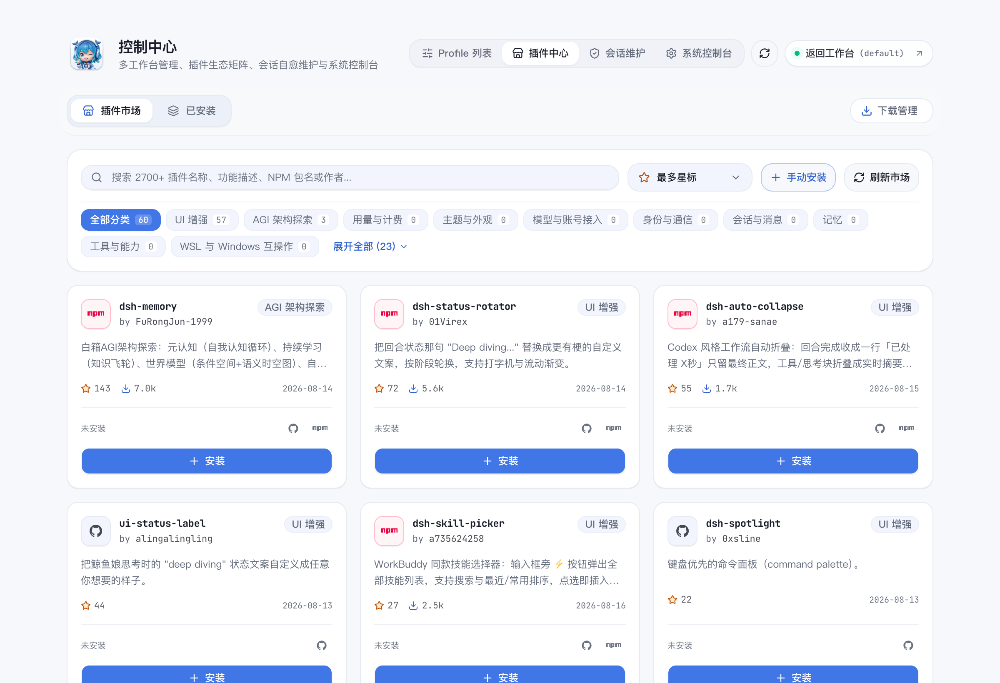
  <p><em>插件中心：社区插件市场浏览、分类筛选与一键安装</em></p>
</div>

<br />

### ③ 会话维护 · 自愈中心

DSH 长任务会话在遭遇断电、进程强杀后，日志序列可能出现重放重叠、序列异常或世代分叉，导致引擎无法正常打开。Dock 提供非破坏性修复：

- **健康巡检**：扫描全部会话，标识健康 / 需自愈 / 状态未知
- **非破坏性原子修复**：自动保留 `.bak` 备份，针对重放重叠、序列异常、世代分叉等可修复损坏做原子级修整
- **一键全量修复**：批量修复所有异常会话
- **按项目分组**：按关联工作区分组浏览，也可切换为平铺视图
- **归档透出**：对齐 dsh 侧栏归档口径，默认隐藏的已归档会话可在此筛选、查看与修复
- **会话概览**：展示标题、所属项目、创建与最后活跃时间、事件总数、结束状态与文件大小

<div align="center">
  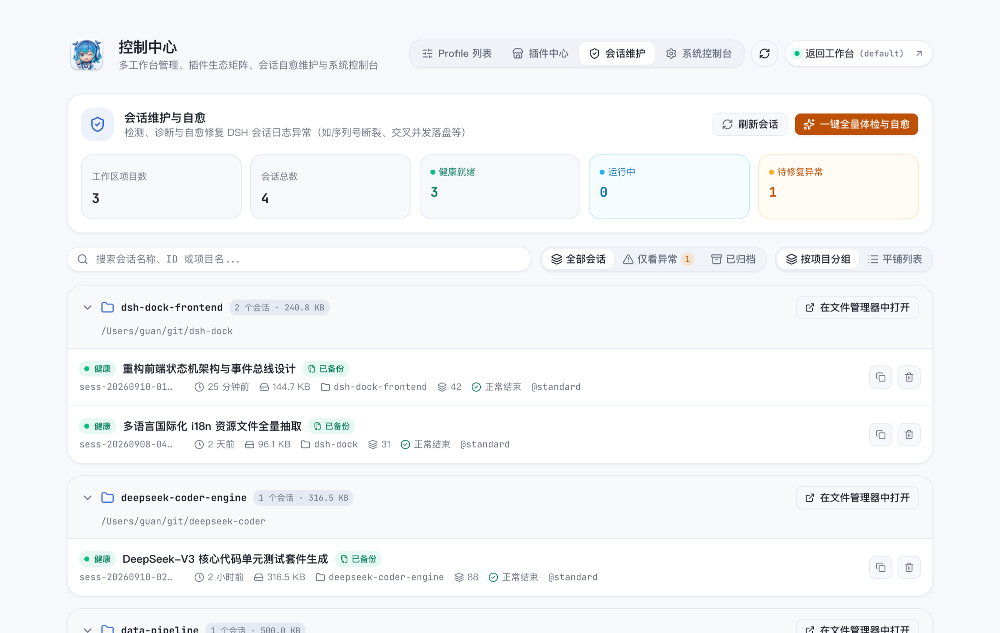
  <p><em>会话中心：健康仪表盘、项目分组列表、状态标识与一键全量自愈</em></p>
</div>

<br />

### ④ 系统控制台 · 凭据与诊断

面向日常运维的系统控制台，包含 5 个子面板：

- **偏好与守护**：界面语言切换（跟随系统 / 中文 / English）、崩溃自动拉起开关、悬浮控制胶囊显隐、快捷键方案选择（`⌘ + ,` 或命令面板风格 `⌘ + ⇧ + P`）
- **模型凭据**：可视化录入和编辑 DeepSeek、OpenAI、Anthropic、Google Gemini、Moonshot (Kimi)、智谱 GLM、Groq、OpenRouter 等服务的 API Key，界面只显示脱敏掩码，支持一键清除；Raw 模式可直接编辑 `.credentials.yaml`，保存时强制 0600 文件权限与原子写入
- **DSH 引擎配置**：直接查看与编辑 `settings.yaml`，保存前弹出破坏性变更确认
- **健康大盘**：一屏体检 Node / pnpm / DSH 三个运行时的版本、路径与就绪状态，展示 `DSH_HOME` 存储空间分布（Profile / 会话 / 缓存），支持一键复制诊断报告
- **运行日志**：3 类日志源（DSH Dock 壳日志 / DSH 运行时日志 / 会话自愈日志），关键词过滤，尾部 600 行实时追踪

<div align="center">
  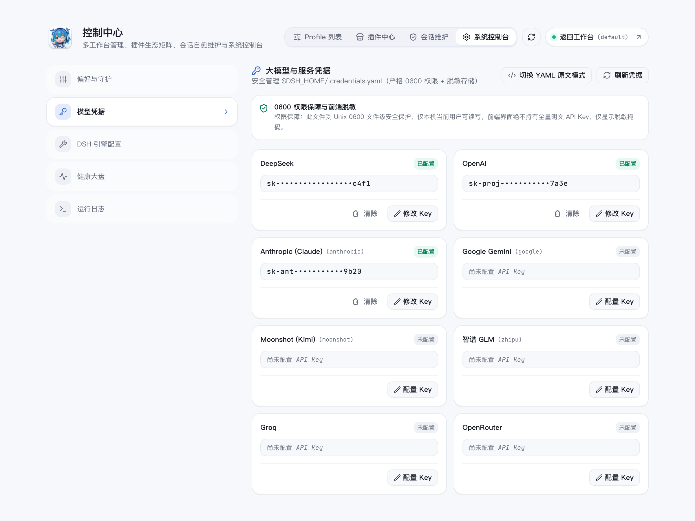
  <p><em>模型凭据：各服务商配置状态一目了然，界面永不持有明文 Key</em></p>
</div>

<div align="center">
  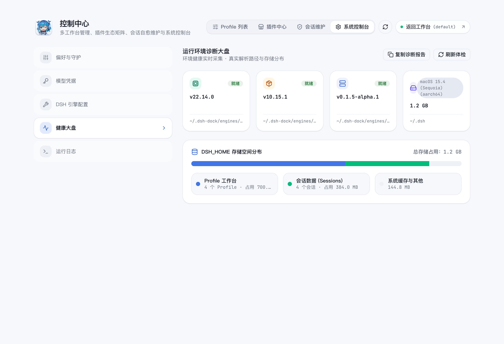
  <p><em>健康大盘：运行时版本与就绪状态、DSH_HOME 存储分布一屏掌握</em></p>
</div>

<div align="center">
  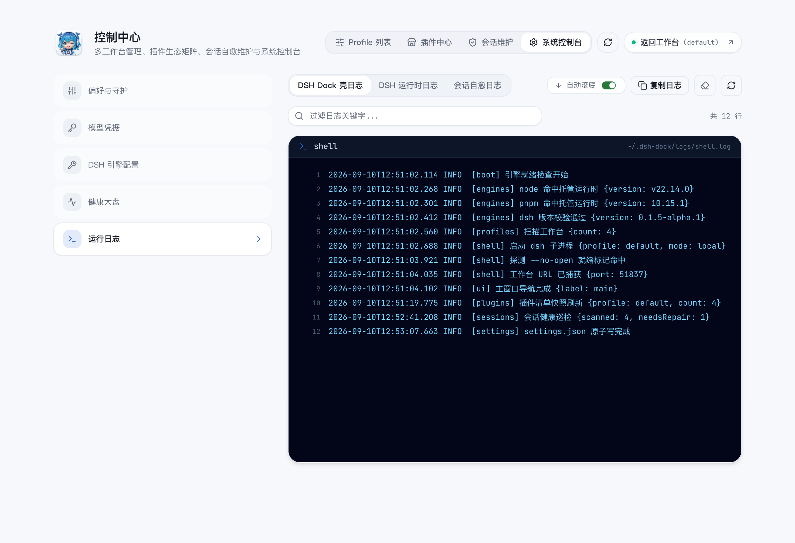
  <p><em>运行日志：三类日志源切换、关键词过滤与实时追踪</em></p>
</div>

<br />

---

## 🖥️ 运行时与桌面集成

贯穿各模块的壳层能力，让 DSH 在桌面上真正"开箱即用"：

- **零配置自举**：启动时检测 Node / pnpm / DSH 三者版本，缺失或版本不符即自动补齐，无需用户干预
- **来源可信**：Node 版本经独立签名映射包（ed25519 验签）锚定并提供 SHA-256 校验和，验签或校验失败一律回退内置基线，不放行未验签数据
- **镜像链加速**：内置镜像链优选高速源，网络异常自动切换备选
- **Windows WSL2 穿透**：自动探测 WSL2 发行版，无感打通 localhost 回环，托盘中一键切换运行模式
- **本机优先**：凭据以 0600 权限仅存本机 `~/.dsh`，工作台与会话数据从不上传；网络面只用于引擎补齐、更新检查与插件市场拉取三件事
- **系统托盘常驻**：最小化运行，快速唤醒与重启
- **单实例防冲突**：多处点击自动聚焦已有窗口，不会产生重复进程
- **优雅停机**：退出时自动清理子进程，不残留僵尸进程
- **崩溃熔断守护**：60 秒内连续 3 次崩溃即停止自动重启，并显示带日志片段的启动失败卡片，避免死循环重启
- **WebView 内存保护**：长会话中自动应用 `content-visibility` 策略，抑制 WebKit 内存膨胀
- **悬浮控制胶囊**：工作台页面内的 Shadow DOM 悬浮按钮，快捷键一键呼出控制中心
- **双轨自更新**：桌面客户端与 DSH 核心引擎分别独立检测、下载与升级
- **DSH 版本管理器**：从 Registry 拉取全版本列表，标注 稳定 / 候选 / 预览（Stable / RC / Alpha）通道，可自选任意版本安装或回退
- **关于与更新中心**：独立窗口展示客户端版本、DSH 核心、Node 运行时、工作台连接状态，支持一键复制诊断信息
- **品牌形象**：3D 鲸鱼娘 Whale-chan 吉祥物 + Apple HIG 标准桌面图标

<div align="center">
  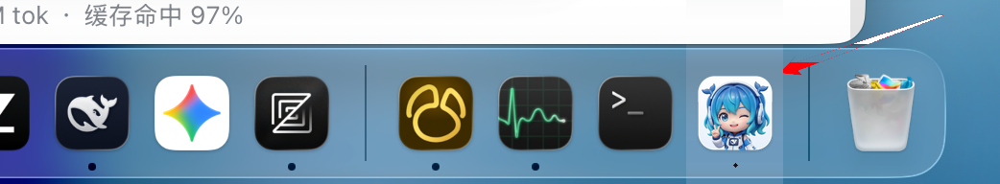
  <p><em>原生桌面融入：Apple HIG 规范圆角与透明边距，在 macOS Dock 中与系统应用同调</em></p>
</div>

<br />

---

## 📥 下载与安装

👉 **[前往 GitHub Releases 下载最新安装包](https://github.com/realguan/dsh-dock/releases)**

| 操作系统 | 支持架构 | 安装包格式 | 体积（约） | 说明 |
| :--- | :--- | :--- | ---: | :--- |
| **macOS** | Apple Silicon (arm64) | `.dmg` | 22 MB | 原生 ARM64，开箱即用 |
| **Windows** | x64 | `.exe` (NSIS) / `.msi` | 39 / 40 MB | 支持 Win 10 / 11，内置 WSL2 穿透；ARM64 设备经系统仿真运行 |
| **Linux** | x64 (amd64) | `.deb` / `.rpm` | 23 MB | Ubuntu / Debian / Fedora 等主流发行版 |
| **Linux** | x64 (amd64) | `.AppImage` | 94 MB | 免安装单文件；因内置 WebKit 运行时故体积偏大 |

> [!IMPORTANT]
> **首次启动需要联网**：安装包不内置 Node.js 与 DSH 引擎（这也是体积能保持在几十 MB 的原因）。首次运行时客户端会经镜像链拉取 Node 运行时并安装 DSH 引擎，补齐后即可离线启动，后续升级全部显式触发。

**其他架构**：当前发布产物覆盖 Apple Silicon (arm64)、Windows x64 与 Linux x64；Intel Mac 等架构可参照 [CONTRIBUTING.md](docs/CONTRIBUTING.md) 从源码自行构建。

> [!WARNING]
> **macOS 首次打开**：若被系统安全策略拦截，在「系统设置 → 隐私与安全性」中点击「仍要打开」即可。

<br />

---

## ⚡ 快速上手

**Step 1**：下载并打开 DSH Dock。首次运行时，引导引擎会自动补齐 Node.js / pnpm / DSH 运行时。

**Step 2**：在启动中心选择或新建工作台。点击「+ 新建工作台」输入名称即可创建独立配置档案。

**Step 3**：进入工作台后即可与 DSH 智能体协作。随时通过悬浮胶囊或快捷键（`Cmd/Ctrl + ,`）呼出控制中心，切换工作台或前往插件市场。

<br />

---

## 🏛️ 架构与设计原则

```
┌────────────────────────────────────────────────────────┐
│                   DSH Dock 桌面壳                      │
│                                                        │
│   ┌────────────────────────────────────────────────┐   │
│   │           前端 UI 层 (React 19 SPA)            │   │
│   │   控制中心  │  插件中心  │  会话维护  │ 控制台 │   │
│   └───────────────────────┬────────────────────────┘   │
│                           │ IPC (强类型安全通道)       │
│   ┌───────────────────────▼────────────────────────┐   │
│   │           内核层 (Rust + Tauri v2)             │   │
│   │   Resolve 宿主解析 │ Updates 验签/镜像链       │   │
│   │   Profiles 管理器  │ Executor (Local / WSL2)   │   │
│   │   Sessions 自愈器  │ Single-Instance 互斥锁    │   │
│   └───────────────────────┬────────────────────────┘   │
└───────────────────────────┼────────────────────────────┘
                            │ 严格遵守 Non-Fork 接口契约
┌───────────────────────────▼────────────────────────────┐
│          DSH 官方运行时 (@deepseek-ai/dsh)             │
│   ~/.dsh/ (profiles, cordis.patch.yml, sessions)       │
└────────────────────────────────────────────────────────┘
```

- **Non-Fork 原则**：不修改上游 DSH 源码，所有协同通过官方 CLI 规范、文件系统与环境变量完成
- **壳产品分离**：壳本体不感知产品硬编码，运行时遵从 `product.manifest.json` 契约
- **技术栈**：Rust 2021 + Tauri v2 / React 19 + TypeScript Strict + Tailwind CSS v4 + Zustand + Radix UI

<br />

---

## 🗺️ 路线图

- [x] **v0.1 ~ v0.3**：Tauri v2 壳体 · 运行时自举链 · WSL2 穿透 · 签名验证
- [x] **v0.4**：Profile 可视化管理 · 插件市场 · 会话自愈 · 自动更新 · Whale-chan 品牌
- [x] **v0.5 ~ v0.9**：凭据管理 · MCP 配置器 · 系统诊断大盘 · 实时日志 · DSH 版本切换 · 崩溃熔断 · 多语言
- [x] **v1.0**：启动台 Launchpad · 会话世代分叉自愈 · 插件安装队列 · DSH 版本选择器 · 覆写前备份与操作确认
- [ ] **v1.1+（Next）**：
  - [ ] 会话时光机 — 时间轴回放与分支流转
  - [ ] 全局 Command Palette — 类 Raycast 的热键呼出、状态速览与即时问答
  - [ ] 工作台云同步 — 加密导出与跨设备 Profile 配置备份

<br />

---

## 🛠️ 参与开发

欢迎参与 DSH Dock 的开源共建！详见 [CONTRIBUTING.md](docs/CONTRIBUTING.md) 了解开发环境搭建、代码规范与 PR 准则。

```bash
git clone https://github.com/realguan/dsh-dock.git
cd dsh-dock/frontend && pnpm install && cd ../src-tauri && cargo tdev
```

<br />

---

## 🤝 社区与支持

- **反馈 Bug 或建议**：[GitHub Issues](https://github.com/realguan/dsh-dock/issues)
- **贡献代码**：[CONTRIBUTING.md](docs/CONTRIBUTING.md)
- **更新日志**：[RELEASE_NOTES.md](docs/RELEASE_NOTES.md) — 各版本功能演进与缺陷修复记录

<br />

## 📄 开源许可证

[MIT License](LICENSE)

<br />

<div align="center">
  <sub>Built with ❤️ by realguan and the community. Powered by DeepSeek Ecosystem.</sub>
</div>
