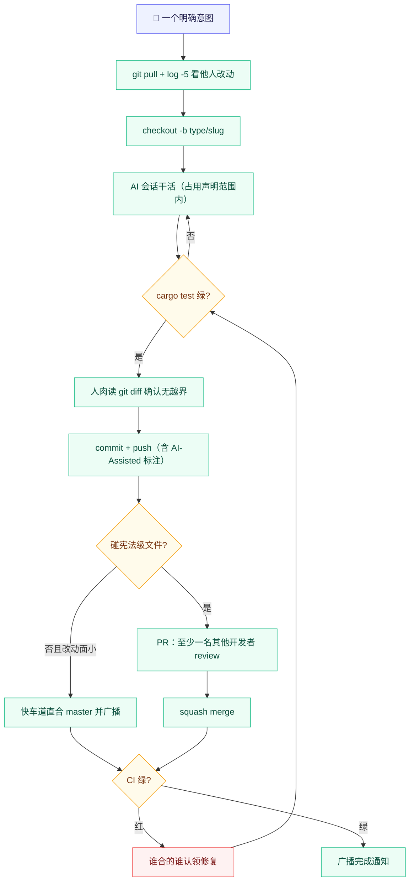

# DSH Dock 协作指南（人类协作者必读）

> 面向所有新加入的开发者。代码怎么写才符合仓库约束见 `AGENTS.md`（AI 编码宪法）；
> 本文件规定「人怎么一起写」——分支、review、占用声明、发布。规则对任意人数成立，
> 人越多执行越严（见 §9 规模进化）。团队共享 Prompt 模板库见 [`docs/prompts/`](./prompts/)。

## 0. 基本盘

每个开发者各带一个（或多个）AI 编码助手，**彼此的 AI 上下文互相不可见**。
所有必须共享的信息，唯一合法载体是仓库落盘内容；口头/私聊「达成一致」不算达成。
不落盘 = 不存在。

**知会的正式载体**：频道消息易沉底、不可检索——宪法级文件改动、快车道直推、
PR 合并完成、发版征集/冻结期等知会类事件，发送频道后须同步登记
[`docs/broadcasts.md`](./broadcasts.md)；事后检索与争议回溯以该档案为准。

## 1. 环境搭建（目标：10 分钟内跑起来）

```bash
# ① Rust toolchain（stable）
curl --proto '=https' --tlsv1.2 -sSf https://sh.rustup.rs | sh   # Windows 用 rustup-init.exe
rustc --version   # 最低 1.77.2（Cargo.toml rust-version）

# ② 平台 Tauri 前置（只缺哪个装哪个）
#    macOS:  xcode-select --install
#    Windows: WebView2（Win10/11 一般自带）+ Visual Studio C++ Build Tools
#    Linux:  sudo apt install libwebkit2gtk-4.1-dev build-essential curl wget file \
#              libxdo-dev libssl-dev libayatana-appindicator3-dev librsvg2-dev

# ③ 克隆并自检
git clone git@github.com:realguan/dsh-dock.git && cd dsh-dock/src-tauri
cargo test        # 全绿 = 环境就绪（首次编译需几分钟）

# ④ 跑起来（默认在线极简档；首次启动需联网补 Node/dsh）
cargo run
```

说明：

- **前端是 React SPA**（`frontend/`，2026-08-27 迁移）：日常开发需要
  `cd frontend && npm ci`（typecheck / lint / test 三闸门与 CI 同款）；
  Rust 侧不依赖 node。
- 出安装包用 `cargo tauri build`——tauri-cli 必须 **2.11.x**（与 tauri crate 同代，
  见 `.github/workflows/build.yml` 的 `TAURI_CLI_VERSION` 注释）。
- `[待补充]` 一键环境脚本（`scripts/setup-env.sh`，检测缺失前置并提示安装命令）；
  容器化暂缓——GUI 壳依赖系统 WebView，容器内只能做 `cargo test` 级验证。

## 2. Git 工作流



### 2.1 分支

- `master` 唯一长期分支，squash merge 保持线性；**禁止对 master `push -f`**。
- 任务分支 `<type>/<slug>`（`fix/wsl-ready-check`），生命周期 ≤ 几天。
- 开工前必看他人最近合入（`git log --oneline -5`），不在过期基线上写码。

### 2.2 提交规范（沿用仓库既有风格 + AI 参与度标注）

| 元素 | 约定 | 示例 |
| :--- | :--- | :--- |
| type | `feat`/`fix`/`chore`/`docs`/`test`/`refactor`/`perf` | `fix` |
| scope | 模块名小写，可空 | `wsl` |
| 描述 | 中文一句话：做了什么 + 为什么 | `WSL 仅 Windows——非 Windows 零 WSL 感知` |

commit message body **必须带 `AI-Assisted:` 标注**（工具中立，写事实即可）：

```text
fix(wsl): UTF-16LE 日志致就绪误判 + 启动页单卡重构

AI-Assisted: <工具名>（会话起草 + 测试生成；人工复核 diff 与 Windows 实机验证）
```

| AI 参与度档位 | 标注写法 |
| :--- | :--- |
| AI 起草，人工逐行复核 | `AI-Assisted: <工具名>（起草；人工逐行复核）` |
| AI 大幅生成，人工抽验 | `AI-Assisted: <工具名>（大幅生成；人工抽验 + cargo test）` |
| 人类手写，AI 仅答疑/补注释 | `AI-Assisted: none（AI 仅答疑）` 或省略 |

一个 commit 一个意图；推送前人必须读过 `git diff`——既是自审，也是确认 AI 没顺手改别的。

## 3. 文件区域与占用声明（N 人通用）

防踩脚 = **占用声明制（先到先得）**，不是固定分工。任何人动任何区域前先在公共频道声明：

| 区域 | 文件 | 规则 |
| :--- | :--- | :--- |
| Rust 后端 | `src-tauri/src/*.rs` | 普通区：按模块声明占用，同模块先到先得 |
| 前端壳页 | `frontend/src`（React）+ `frontend/index.html` | 普通区：同上 |
| 共享区 | `lib.rs` 注入脚本、IPC 三件套（lib.rs 命令 + build.rs + capabilities）、CI workflow、`Cargo.lock` | 改动前必声明，尽快合完释放 |
| 宪法级 | `AGENTS.md`、`docs/contract.md`、本文件、`node-map/` | 同一时间仅一人可改；知会全体 + 至少一名其他开发者看过 |

- 禁止全仓扫荡式操作（全仓 fmt / 批量重命名 / clippy --fix）——只允许在自己声明的范围内做。
- commit 写明「动到：xxx」，占用自然释放。
- 区域协作者变多时设志愿**看门人**（负责该区域 review 入口与裁定归档），非职务。

## 4. Code Review 流程

**原则：重点审「意图正确」和「测试真实」，而非语法风格**（语法归 fmt/clippy 和 AI）。

Reviewer 回答五个问题，答完即可批（vibe coding 不要求逐行）：

1. **意图**：这个 PR 解决的问题描述清楚吗？改动方向是解这个问题，还是绕开它？
2. **边界**：动了哪些文件？有没有超出作者声明的占用范围？有没有 AI 顺手带入的无关改动？
3. **红线**：踩了 `AGENTS.md` 的禁止项吗（unwrap / 触网越界 / 硬编码产品身份 / UI 引构建链）？
4. **测试**：声称的测试真的存在且覆盖新行为吗？（本地跑一遍 `cargo test`，别只信 CI 徽章）
5. **风险**：跨平台行为（mac/win/linux/wsl）、既有用户数据兼容性，有被破坏的点吗？

- Review 时限：24 小时内至少给一次回应（问题或批准）；超时可催一次，再超时可在频道点名。
- 意见分歧：diff 摊开讨论，讨论不动交由宪法级文件裁定；仍僵持由发起 ADR 解决。
- 合并统一 squash；合并人负责确认 CI 绿。

## 5. PR 模板

创建 PR 时使用以下结构（已同步到 `.github/pull_request_template.md`，GitHub 会自动填充）：

````markdown
## 意图（为什么改）

<!-- 一段话：解决什么问题 / 关联 issue / 关联 ADR -->

## 改动范围（动了什么）

<!-- 动到：文件/模块清单；是否触碰宪法级文件（AGENTS.md / contract.md / capabilities）-->

## AI 参与度

- 工具：<!-- 如 Claude Code / Copilot / Aider / Cursor / Windsurf / 无 -->
- 参与方式：<!-- 起草 / 大幅生成 / 测试生成 / 仅答疑 -->
- 人工动作：<!-- 逐行复核 diff / 抽验 / 实机验证 -->

## 验证方式

- [ ] `cd src-tauri && cargo test` 全绿
- [ ] 手动路径验证：<!-- 描述跑了什么：cargo run 启动链 / 某页面操作 / 三平台哪台 -->
- [ ] 新增/修改测试：<!-- 列出测试名；无测试需说明理由 -->
- [ ] 平台影响评估：<!-- macOS / Windows / Linux / WSL 各自受不受影响 -->

## 剩余风险与后续项

<!-- 已知未覆盖的场景、留给下一次的技术债、需要 follow-up 的 ADR/文档 -->

## 占用声明回执

<!-- 公共频道占用声明的链接或截图时间点；一次性小改可写"无需声明" -->
````

## 6. AI Vibe Coding 会话纪律

**会话开始**：`git pull` → `git log --oneline -5` → 扫 `AGENTS.md` 新裁定 →
触碰共享区先发占用声明。
**会话中**：一个会话一个明确意图；AI 的记忆以仓库现状为准，不猜、不静默扩权；
禁止让 AI 动未声明的区域。
**会话结束**：`cargo test` 绿 → 人肉读 `git diff` → commit + push（AI-Assisted 标注）→
频道广播完成通知 → 新裁定 20 分钟内落盘 `AGENTS.md`/`docs/`。

**禁区**（违反 = 全体约谈）：两个以上 AI 同时往 master 直推（快车道例外但必须广播）；
让 AI 处理冲突后 `push -f`；把他人 commit 塞进自己 AI 让它重写（→ 用 git 操作）；
说「改好了」但没 push 没 commit 没广播。

## 7. 冲突与事故处理

| 事故 | 协议 |
| :--- | :--- |
| merge/rebase 冲突 | **后提交者负责解**。先读对方 commit 意图，保留双方意图，解完 `cargo test` 再合；拿不准（contract.md / Cargo.lock）拉涉事方一起看，不独自裁决 |
| CI 红在 master | 谁合的谁修（或立即认领）；禁止红着合、跳 CI 强推 |
| 回滚 | `git revert`（保留历史）；回滚前确认无人基于该 commit 干活 |
| AI 改了不该改的 | `git checkout <commit> -- <file>` 恢复；教训写进 §6 纪律 |
| 占用冲突 | 先声明者优先，后者让路；协商优先，不搞「谁 push 快谁赢」 |

## 8. 发布协议

- tag `v*` 触发 Release（CI 自动）。发版前公共频道征集确认：≥1 名活跃维护者同意、
  无未解决的红 CI。发起人打 tag 并从 commit log 提炼 Release notes
  （模板：`## 新增 / ## 修复 / ## 变更 / ## 已知问题`）。
- 版本 bump：`chore: 版本 x.y.z（一句话）`（仓库先例）。
- 契约升级按 `docs/contracts/` 流程：单独分支 + 相关方确认 + 同一 PR 合入。
- **node-map 私钥红线**：只存在于本地私有 + CI secret。严禁入库、贴聊天、进任何 AI 上下文。
- 发版 tag 后进入**冻结期**：Release notes 发出至三平台产物验收通过期间，master 只收
  fix，不收 feat（详见 `docs/contracts/README.md` §冻结期）。

## 9. 规模进化

| 活跃人数 | 调整 |
| :--- | :--- |
| 2 人 | 默认档：占用声明 + 快车道 + ≥1 名他人 review |
| 3 人起 | 看门人默认化；每周 10 分钟短同步；宪法级文件强制 review（快车道不再适用）；占用声明提前量拉长 |
| 5 人起 | master 分支保护（强制 PR + CI 检查）；区域 Maintainer 角色；占用声明改为提前一天登记的计划表 |

## 10. Prompt 模板库

团队共享的结构化 Prompt 在 [`docs/prompts/`](./prompts/)：新功能实现 / 代码审查 /
Bug 排查 / 重构。用法：复制模板填空 → 作为你的 AI 工具的任务输入 → 结果按本指南
§6 纪律处理。改进模板 = 正常 PR（它们也是仓库资产）。

---

> [!IMPORTANT]
> 本文件本身是宪法级文件：修改前在公共频道知会所有活跃协作者，合并走 PR。
