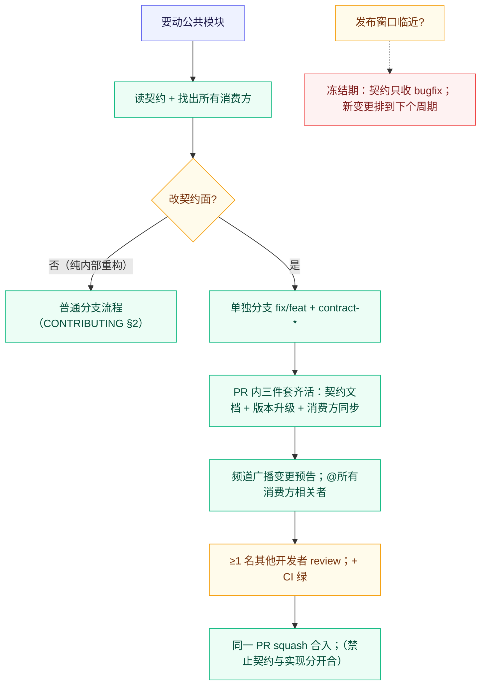

# 模块契约规范（Contracts）

> 目的：多人 × 多 AI 协作下，防止有人（或某个 AI）绕过公共接口改内部实现，
> 导致另一侧在不知情中坏掉。契约 = 「这一面不许悄悄变」的书面承诺。

## 1. 哪些模块需要写契约

满足任一条即为「公共模块」，改动必须维护对应契约：

| 判定条件 | 本仓库现状 |
| :--- | :--- |
| 跨仓库/跨进程消费的接口 | `docs/contract.md`（product.manifest.json：壳 ↔ 装配方）；node-map 的 `map.json` 格式（npm 包 ↔ 壳验签） |
| 前端 ↔ Rust 双侧共用的调用面 | IPC 命令与事件协议（AGENTS.md §7 登记册；`lib.rs` + `build.rs` + `capabilities/` 三处同步） |
| 被两个以上模块依赖的稳定内部接口 | `executor.rs` 的 Executor 抽象（shell/boot 只认识 Executor，local/wsl 各自实现）；`updates` 回调上抛协议 |
| 对外发布的产物格式 | `@dsh-dock/node-map` npm 包（map.json + 签名，见 node-map/README.md） |

不需要写契约的：单模块内部的函数、页面私有样式、一次性脚本。
判断口诀：**消费者不在你这次 commit 里 = 有契约。**

## 2. 契约文档的标准格式

每份契约一个文件（跨进程契约放 `docs/`，如已有的 `contract.md`；
模块级契约放 `docs/contracts/<module>.md`），结构如下：

```markdown
# <模块名> 契约

## 状态
版本：<vN>｜状态：稳定 / 演进中 / 冻结｜消费方：<列出>

## 接口签名
<导出函数/trait/命令的精确签名，含参数类型、返回值、失败语义（错误种类）>
<!-- 示例：Executor::spawn(&self, req: SpawnRequest) -> Result<Session, ExecutorError>
     失败语义：NodeMissing / DshMissing / ProbeFailed；不 panics、不触网 -->

## 数据模型
<跨边界的 struct/schema 逐字段表：名称、类型、必填、约束、演进规则>
<!-- 示例见 docs/contract.md 的 product.manifest.json 字段表 -->

## 行为承诺
<时序保证、资源责任（谁 spawn 谁收尸）、平台差异点、性能上限>
<!-- 示例：wait_for_ready 硬上限 90s；进程退出立即判败；日志无进展 20s 判 Stalled -->

## 禁止外部访问的内部实现
<明确列出非公开面：私有函数、内部锁、临时文件布局——消费方依赖即违规>
<!-- 示例：ShellState.session 的锁策略是内部实现；updates 的镜像探测顺序细节
     不承诺稳定，消费方只可依赖「镜像链最终成功或报错」 -->

## 演进规则
<兼容策略：加字段是否可选、format 如何升、废弃流程>
```

要点：

- **接口签名与数据模型用代码级精确度**，形容词（「快速的」「灵活的」）禁止入契。
- **内部实现清单同样重要**：写明「不许依赖什么」比写明「提供什么」更能防耦合。

## 3. 契约测试的编写要求

- **位置**：Rust 侧写在被测模块的 `#[cfg(test)]`（先例：`manifest.rs` 对 v1/v2
  manifest 的正反例测试、`resolve.rs` 对解析链的测试、`lib.rs` 对 URL 白名单的测试）。
- **必须覆盖**：
  1. **正例**：合法输入 → 预期输出（每个已支持的 format/变体一组）；
  2. **反例**：缺字段、错 format、非法值 → 明确拒绝而非静默容忍；
  3. **拒绝路径**：契约声明「不支持」的行为确实被拒绝
     （如 `file://`/`data:` 导航拒绝、非白名单外链拦截）。
- **不 mock 消费方**：契约测试验证本模块对契约的遵守；两侧联调走集成验证清单
  （如 WSL 实机清单）。前端消费面暂无自动化 UI 测试 `[待补充]`——建议引入轻量
  静态校验脚本（校验 ui/*.html 引用的命令名都在 §7 登记册内）前，以人工 checklist
  兜底：新增命令 PR 必须附「三处同步」自查截图。
- 新增/修改契约时，契约测试与契约文档必须在**同一个 PR**。

## 4. 修改公共模块的流程



- **单独分支**：契约变更永不与其他意图混车；分支名带 `contract-` 前缀便于识别。
- **尽快合并**：契约分支存活时间 ≤48 小时——它是别人的依赖，悬空越久，
  别人基于旧契约开工的概率越大。开分支前先在频道发变更预告就是为此。
- **冻结期**：从「发布 tag 提议」到「三平台产物验收通过」期间，契约面冻结，
  只收 bugfix；紧急安全修复除外（需频道说明）。
- **向后兼容默认义务**：能加字段就别改字段，能可选就别必填；破坏性变更 =
  升 format（`MANIFEST_FORMAT`）+ 迁移说明写入契约「演进规则」节 +
  壳对旧 format 的拒绝行为有测试兜底。

## 5. 当前契约台账

| 契约 | 文档 | 版本 | 消费方 |
| :--- | :--- | :--- | :--- |
| 产品运行时（product.manifest.json） | [../contract.md](../contract.md) | format 1/2 | 壳全部启动链 ↔ 外部装配方 |
| Node 映射包（map.json + 签名） | [../../node-map/README.md](../../node-map/README.md) | 0.0.1 | 壳 updates ↔ npm registry |
| IPC 命令与事件 | AGENTS.md §7（登记册） | 随登记演进 | ui/\*.html ↔ src-tauri |
| Executor 抽象 | [../executor.md](../executor.md) | local+wsl v1 | shell/lib ↔ 各执行环境 |
| 客户端自更新 feed | tauri.conf updater endpoint | latest.json | 壳 updater ↔ GitHub Releases |

> [!WARNING]
> 台账里没有、但两个模块正在共享的东西 = 未登记的事实契约。
> 发现即登记（开 PR 补契约），或在 review 中打回——最危险的不是坏契约，是没写下来的契约。
