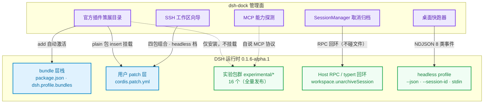
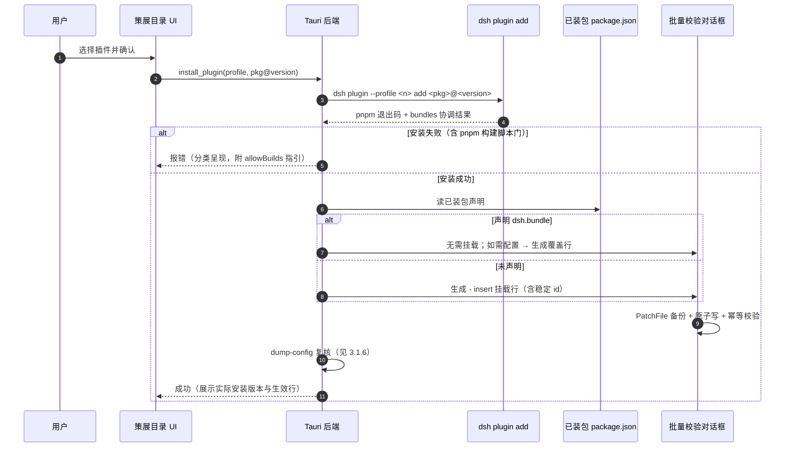
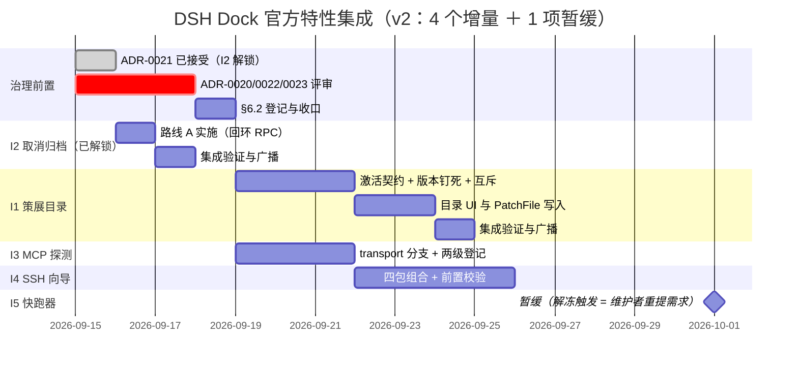

# DSH 官方插件管理与新增特性集成实施计划（修订版 v2）

> **文档定位**：面向 dsh-dock（DSH 桌面管理面板）下一阶段功能迭代的架构设计与分阶段实施方案。
> **适用版本**：DSH 运行时 `0.1.6-alpha.1`，dsh-dock `v1.2.0+`。
> **基准日期**：2026-09-15
> **当前状态**：**I1 / I2 / I3 / I4 全部解冻可开工**。2026-09-15 维护者裁定：
> ADR-0021 已接受（I2 已实施完毕）、**ADR-0020 / 0022 / 0023 评审通过**（I1 / I3 / I4 解冻）；
> ADR-0024 暂缓（"暂时不做"，I5 移出当前批次，未否决）。ADR 一览见 §6.1。
> **配套审核报告**：`docs/plans/official-plugins-and-capabilities-plan-review.md`（v1 审核，7 项阻断缺陷）

---

## 0. 修订记录

| 版本 | 日期 | 变更 |
|:---|:---|:---|
| v1 | 2026-09-15 | 初稿 |
| **v2** | 2026-09-15 | 依审核报告修正 7 项阻断缺陷（B1–B7）＋ 6 处文档订正；拆分实施增量为 5 个独立交付；补齐治理前置清单 |
| **v2.1** | 2026-09-15 | 落维护者裁定：**ADR-0021 已接受**（I2 解锁可开工）；**ADR-0024 暂缓**（「暂时不做」，I5 移出当前批次，未否决，`roadmap` §5 边界留白）。批次由 5 增量收敛为 **4 增量 ＋ 1 项暂缓** |
| **v2.2** | 2026-09-15 | **ADR-0020 / 0022 / 0023 评审通过** → I1 / I3 / I4 解冻；I2 已实施完毕并实机验证（含 `/api` 鉴权栅栏修复）。§6.3 更正一处**过度声明**（I2 未收口 roadmap §4.6 的「工作区增删管理」子项） |

**v2 相对 v1 的实质性变更（逐条对应审核报告 B 编号）**：

| 变更 | 说明 |
|:---|:---|
| **激活契约重写**（B1/B2） | v1 的"先 `add` 再写 patch"流程对 bundle 类包会**重复挂载**、对 plain 类包又会因写法无效而**静默漏挂**。v2 引入"是否声明 `dsh.bundle`"分支，并给出 `insert` / 覆盖两种写法的语义边界。 |
| **版本钉死**（B3） | v1 用裸包名，实测解析到 `0.1.5-alpha.2`（运行时为 `0.1.6-alpha.1`）。v2 要求版本由运行时推导并显式携带。 |
| **P0-2 收敛**（B4） | v1 把"新增归档筛选"列为待开发；实测该能力**壳内已实现（2026-09-07）**，且**上游已自带取消归档 UI**。v2 收缩为"仅新增写动词"，并增设需求存续裁定。 |
| **IPC 契约补全**（B5） | 补 `AppHandle`、补第 4/5 同步面、明确实现路线（Host RPC 优先，文件改写次选）。 |
| **MCP 合规路径重写**（B6） | v1 的"严格通过 `updates.rs`"属定性错误；v2 按 transport 分支给出两条合规路径与登记清单。 |
| **SSH 范围与前置重写**（B7） | 补 `helper`/`helperHash` 必填、远端 helper 预装、四包组合、平台限制；**撤销"Web 侧透明远程开发"承诺**。 |
| **目录设计补全** | 新增 provider 互斥、配套关系、策展定位（非"官方首批"）、`id` 稳定性与 `config` 整体替换语义。 |
| **实施节奏重构** | 单一时间线 → **5 个独立增量**（AGENTS §8.1/§8.2）；每增量补齐测试义务（§8.3）与落档义务（§8.5）。 |

> **v1 中经审核**证实**正确**的部分已原样保留：headless 三旗标与出厂 profile、全部官方包名、`unarchiveSession` 符号、MCP 方法名、侧边栏终端随 `dsh-web-app` 自动可用、两条红线的遵守意识。详见审核报告 §5。

---

## 1. 背景与目标

DSH 在 `0.1.6-alpha.1` 中提供了一批高价值但默认不启用的能力：工具调用前的自动安全审查（Auto review）、浏览器操作（Browser Use）、本地桌面控制（Computer Use）、多智能体协同（Agent Teams）、POSIX SSH 远程执行、自动会话归档与恢复、MCP 资源与 URI 模板，以及可编程的 headless 运行流。

这些能力分布在 `packages/experimental/`（实验性包，上游明文"contracts can change and carry no support promise"）与特定 profile 机制中，**默认 profile 不主动启用**。用户要使用它们，需要读源码、手写 YAML、敲 CLI。

作为 dsh 的**桌面管理面板**，dsh-dock 的价值是把这些能力以桌面化、可视化、可回滚的形式交付——**在恪守两条红线的前提下**：

1. **不修改 dsh 源码**（不 fork / 不打上游补丁；允许读源码、调 CLI、文件系统层复现，但复现须登记 `docs/contracts/dsh-behavior-ledger.md`）；
2. **安装包不内置依赖**（Node / dsh 由引擎引导自补齐；唯一例外是随壳内置的 pnpm 引导器）。



---

## 2. 功能规划与优先级矩阵

| 模块 | 目标形态 | 优先级 | 代码面（**已核对真实路径**） | ADR | 用户价值 |
|:---|:---|:---:|:---|:---:|:---|
| **官方插件策展目录** | 插件中心新增策展视图，支持按**激活契约**一键安装/挂载/配置，含版本钉死与 provider 互斥 | **P0** | `frontend/src/components/market/{MarketplaceView,PluginHub,MarketPluginCard,MarketInstallDialog}.tsx`<br/>`frontend/src/types/market.ts`<br/>`src-tauri/src/plugins.rs` | 0020 | 极高：消除官方新特性的启用门槛 |
| **已归档会话取消归档** | `SessionManager` 增加"取消归档"写动词 | **P0** | `frontend/src/components/profiles/SessionManager.tsx`<br/>`src-tauri/src/commands/session.rs`<br/>`src-tauri/src/sessions.rs` | 0021 ✅ 已接受 | 中：读路径与筛选**已存在**；增量仅写动词（**路线 A，2026-09-15 认可，I2 已解锁**） |
| **MCP 能力探测** | `McpManager` 增加连通性与能力探测（Tools / Resources / Templates） | **P1** | `frontend/src/components/profiles/McpManager.tsx`<br/>`src-tauri/src/mcp.rs`<br/>（MCP 命令现居 `src-tauri/src/commands/console.rs`） | 0022 | 高：配置体检与失败归因（须先论证相对模型侧三工具的增量） |
| **SSH 远程工作区向导** | 读取 `~/.ssh/config`，校验远端，生成专用 profile（**限 headless / 自建档**） | **P1** | `frontend/src/components/profiles/ProfileCreateDialog.tsx`<br/>`src-tauri/src/profiles.rs` ＋ 新增 IPC | 0023 | 高：跨端执行；**但 Web 视图不随 provider 变为远端感知** |
| **桌面任务快跑器** | 全局热键呼出轻量窗口，消费 `dsh --profile headless --json` | ~~P2~~ **暂缓** | 新增前端窗口 ＋ `src-tauri/` 新增命令模块 | 0024 ⏸ 暂缓 | **2026-09-15 维护者裁定「暂时不做」**：未否决，当前批次不实施；`roadmap` §5 边界问题留白 |

> [!NOTE]
> **Web 侧边栏终端无需 dsh-dock 做任何事**。`@deepseek-ai/dsh-api-terminal-controller` 与 `@deepseek-ai/dsh-client-ui-sidebar-terminal` 由 `dsh-web-app` bundle **无条件挂载**（`packages/bundle/web-app/cordis.patch.yml:107-108, 233-235`，无 `disabled`/`config`），多标签与刷新恢复均为真实能力。两个限定必须写明：**进程不跨 Host 重启存活**（`ui-sidebar-terminal/README.md:73`），且该能力**绑定 web profile**（`dsh-base` bundle 不含终端依赖）。因此 dsh-dock 本阶段重点补齐的是**管理控制面**。

### 2.1 实施增量拆分（AGENTS §8.1/§8.2）

v1 把 5 个特性、12 个工作项、跨 6 个模块的改动打包成一条时间线，违反"一次会话只做一个明确意图"与"禁止跨模块批量改动"。v2 拆为 **5 个独立增量**，各自独立评审、独立合入、独立广播；**v2.1 依维护者裁定收敛为 4 个在办增量 ＋ 1 项暂缓（I5）**：

| 增量 | 范围 | 前置 | 预估 |
|:---:|:---|:---|:---:|
| **I1** | 官方插件策展目录（含激活契约、版本钉死、互斥） | ADR-0020 批准 | 4–6 天 |
| **I2** | 取消归档写动词（路线 A） | ✅ ADR-0021 **已接受**（2026-09-15）——**已解锁，可开工** | 1–2 天 |
| **I3** | MCP 能力探测（transport 分支 ＋ 两级登记） | ADR-0022 批准 | 3–4 天 |
| **I4** | SSH 工作区向导（headless 档） | ADR-0023 批准 | 4–6 天 |
| ~~**I5**~~ | ~~桌面快跑器~~ —— **暂缓**（2026-09-15 维护者裁定"暂时不做"，**未否决**） | 解冻触发 = 维护者重新提出该需求；重开后先裁定 `roadmap` §5 边界（ADR-0024 §6） | — |

I1 与 I2 无相互依赖，**I2 已解锁可立即开工**；I3 独立；I4 依赖 I1 的 patch 写入内核（`plugins.rs::PatchFile` 复用）。**I5 移出当前批次**（暂缓），其平台扩展（`tauri-plugin-global-shortcut` 新依赖、第四个窗口）**未获批准**，暂缓期间不得先行引入。

---

## 3. 详细设计

### 3.1 增量 I1：官方插件策展目录（ADR-0020）

#### 3.1.1 定位：这是 dsh-dock 的**策展集**，不是"官方首批"

上游**没有**"首批"概念，政策是**全量发布**：`packages/experimental/README.md:12` 明示全部包按 `@deepseek-ai/dsh-experimental-*` 发布，`scripts/experimental-package-policy.ts:2` 的私有例外清单为空数组。当前共 **16** 个包。dsh-dock 完全有权策展一个精选子集，但文案与文档必须写明**"dsh-dock 策展范围"**，不得表述为官方批次。

#### 3.1.2 激活契约（本方案的核心，v1 在此处两向皆错）

**关键事实：`dsh plugin --profile <n> add <pkg>` 不是单纯的 pnpm 转发器。** 它先 `pnpm add`，再**按已装状态协调 `dsh.profile.bundles`**：解析到声明 `dsh.bundle` 的包 → **追加进 bundle 层栈**（`apps/cli/src/plugin.ts:59-91`，写清单 `:88-91`；检测条件 `:36-45`）；未声明的包 → **仅装为普通依赖并打警告**（`:70-75`）。

因此安装后的**挂载责任按目标包分类**：

| 目标包是否声明 `dsh.bundle` | `add` 后是否已挂载 | 壳必须做什么 | 壳**禁止**做什么 |
|:---|:---:|:---|:---|
| ✅ 声明（bundle 类） | **是**（自动进 `dsh.profile.bundles`） | 若要改配置：写**覆盖行** `- id: <既有行id>` | ❌ **禁止**写 `- insert:`（会**重复挂载**：行身份键是 `id`，`vendor/loader/src/config/tree.ts:51-59`） |
| ❌ 未声明（plain 类） | **否**（仅装为依赖 + stderr 警告） | 写**挂载行** `- insert: [{id, name, config}]` | ❌ **禁止**只写 `- name:`（DSH 报 `patch: id is required for non-insert patches`、**退出码 0**、条目被丢弃 → **静默漏挂**） |

**实测分类表**（`packages/experimental/*/package.json` 实查）：

| 包 | `dsh.bundle` | 壳的动作 |
|:---|:---:|:---|
| `dsh-experimental-auto-review` | ✅ | 自动激活；仅需覆盖配置 |
| `dsh-experimental-agent-team-profile` | ✅ | 同上（**v1 未收录**） |
| `dsh-experimental-agent-team-web-profile` | ✅ | 同上（**v1 未收录**） |
| `dsh-experimental-browser-use-playwright-mcp` | ❌ | 须 `insert:` 挂载 |
| `dsh-experimental-browser-use-chrome-devtools-mcp` | ❌ | 须 `insert:` 挂载 |
| `dsh-experimental-browser-use-stagehand-native` | ❌ | 须 `insert:` 挂载 |
| `dsh-experimental-computer-use-cua-driver-mcp` | ❌ | 须 `insert:` 挂载 |
| `dsh-experimental-computer-use-cua-driver-native` | ❌ | 须 `insert:` 挂载 |
| `dsh-experimental-agent-team` | ❌ | 须 `insert:` 挂载 |
| `dsh-experimental-tool-agent-team` | ❌ | 须 `insert:` 挂载（**v1 未收录**） |

> [!WARNING]
> **v1 的流程会产生两类相反的错误，且都是静默的**：统一 `insert:` → `auto-review` 双挂；统一 `- name:` → 6 个 plain 包全部不生效。实现**必须**以"目标包是否声明 `dsh.bundle`"为分支依据，该判定应读取已装包的 `package.json` 而得，不得硬编码猜测。



#### 3.1.3 版本必须钉死（v1 的裸包名会装错版本）

**实测**：`dsh plugin add <裸包名>` 按 **`latest`** dist-tag 解析。Agent Teams 三个包的 `latest` **落后**于运行时：

| 包 | `latest` | `alpha` |
|:---|:---|:---|
| `dsh-experimental-agent-team` | **0.1.5-alpha.2** ⚠️ | 0.1.6-alpha.1 |
| `dsh-experimental-agent-team-profile` | **0.1.5-alpha.2** ⚠️ | 0.1.6-alpha.1 |
| `dsh-experimental-tool-agent-team` | **0.1.5-alpha.2** ⚠️ | 0.1.6-alpha.1 |
| 其余（auto-review、browser-use×3、computer-use×2、ssh×4） | 0.1.6-alpha.1 ✅ | 0.1.6-alpha.1 |

实测裸装得到 `0.1.5-alpha.2`；`add "<pkg>@0.1.6-alpha.1"` 得到正确版本，**且 bundle 协调照常生效**（两者可叠加）。这与台账 #7 已记载的 dsh-base dist-tag 事故同源。

**要求**：① 期望版本由**已装 dsh 运行时版本**推导（可复用 `resolve.rs` 版本闸与 `list_dsh_versions` 的通道归类）；② 一律以 `<pkg>@<version>`（或 `@alpha`）形式下发；③ 安装确认弹窗**显示将要安装的确切版本**。

#### 3.1.4 patch 行的写作规则

| 规则 | 依据 |
|:---|:---|
| 挂载用 `- insert: [{id, name, config}]`；覆盖既有行用 `- id:`（或 `- name:`） | `packages/bundle/base/README.md:55-61`；`docs/user/develop/basic/config.md:37-45` |
| 真实 schema 为 `PatchOptions`（`id`/`insert`/`name`/`config`/`group`/`disabled`/`inject`/`intercept`/`isolate`）与 `EntryOptions`（`id`/`name`/`config`/`group`/`disabled`/`inject`）；**无 `before`/`after` 排序键**，顺序即数组位置 | `vendor/include/src/index.ts:129-141`；`vendor/loader/src/config/entry.ts:9-22` |
| 每个生成行**必须自带稳定、可复算的 `id`**——缺 `id` 会被自动生成，该行此后**再也无法被 patch 命中** | `vendor/loader/src/config/tree.ts:51-59` |
| 写 `config` 键 = **该行 config 整体替换，不深合并** → 必须先读出该行现有完整 config 再回写 | `packages/bundle/base/README.md`；`docs/roadmap.md:31`（已登记陷阱） |
| 一切写入统一走 `plugins.rs::PatchFile`（覆写前备份 ＋ 原子替换 ＋ 未改条目原文保真） | AGENTS §6:131；`plugins.rs:1284` |
| 写后**必须以 `dsh --profile <n> --dump-config` 复核**目标行确实出现在组合树中 | 本方案新增闸门；形态参照台账 #13 的 `dump-config` 段落解析 |

#### 3.1.5 provider 互斥（v1 完全缺失）

**同族 provider 互斥，装第二个会激活失败**：
- 浏览器三选一（只装一个 `browser-use-*`）；口径见 `docs/subsystems/browser-use.md:17`。
- 桌面控制二选一；`computer-use-cua-driver-mcp/README.md:53`："A second computer-use provider **fails activation**, including another instance of this package."

**要求**：目录 UI 必须把互斥族建模为**互斥组**，第二个提供**"替换"语义**（先移除再安装），而非"叠加"。安装前若检测到同族已装，必须显式提示并走替换流程。

#### 3.1.6 配套关系表（v1 的配套分析不完整）

| 主包 | 必需配套 | 说明 |
|:---|:---|:---|
| `browser-use-playwright-mcp` / `-chrome-devtools-mcp` / `-stagehand-native` | 可挂载的 release 服务 `@deepseek-ai/dsh-browser-use` ＋ **恰好一个** provider | `browser-use-runtime` **是库、无 `dsh.bundle`、不可挂载**（`browser-use-runtime/README.md:28`："It has no plugin entry or mount configuration."），只能作为依赖被带上。`stagehand-native` 另需 `model` 配置（`README.md:43`） |
| `computer-use-cua-driver-mcp` / `-native` | `@deepseek-ai/dsh-computer-use`（peer）＋ `@deepseek-ai/dsh-mcp-client` | **不存在** `computer-use-runtime`（`packages/experimental/*runtime*` 无此包）；`-mcp` 变体另需外置 `cua-driver` |
| `agent-team` | **`tool-agent-team`** ＋ 会话持久化（`@deepseek-ai/dsh-session-persistence-jsonl`） | `agent-team` 自述"It provides **no tools of its own**"（`agent-team/README.md:12`）；inject 含 `sessionPersistence`/`sessionProjections`（`agent-team/src/index.ts:60`） |
| `agent-team`（便利层） | **headless / 自建档** → `agent-team-profile`；**Web 档** → `agent-team-profile` **然后** `agent-team-web-profile` | 两个 profile 层自身都是 bundle，装它即自动激活（`agent-team-profile/cordis.patch.yml:16-29` 会一并插入 `agent-team` 与 `tool-agent-team` 两行）。`agent-team-web-profile` 的 `dependencies` 含 `client-ui-agent-team`，**无需单独安装**。二者用途不同不可互换：`agent-team-profile` 是基于 `@deepseek-ai/dsh-base` 的通用 opt-in 层，`agent-team-web-profile` 才是 Web 层 |

> [!WARNING]
> **Agent Teams 是"有序多步安装"，不是单次点击。** `agent-team-web-profile/README.md` 要求"Add the Host and Web Agent Teams layers to an initialized `web` profile **in this order**"，且其 Known Limitations 明文："**Ordered composition** — `dsh-base`、`dsh-web-app`、`dsh-experimental-agent-team-profile`、and this package **must remain in that order**"。其 `cordis.patch.yml` 首行注释亦为"Apply **after** `dsh-web-app` and the host-side `dsh-agent-team-profile` so the browser mounts only when the Team service is present"。
> 含义：① 该条目的"一键安装"实为**两步有序操作**（先 `agent-team-profile`，再 `agent-team-web-profile`）；② 结果清单 `dsh.profile.bundles` 的**顺序即语义**，装反了浏览器侧会因 Team 服务尚未就位而挂载失败；③ 每次 `add` 只接受一个包，故必须**串行**下发（既有安装队列本身就是串行编排，可复用）。目录 UI 必须把这类条目建模为**有序组合**，并在失败中断时能回滚到"只装了第一步"的一致状态。
> 一般化：任何"配套关系"条目（含 browser/computer-use 的服务＋provider）都应走同一条有序安装路径，禁止并发下发。

> [!NOTE]
> **5 个 browser/computer provider 的上游 README 没有给出任何 `dsh plugin` 命令**，只有手工 YAML 行；`auto-review` 的 README 给的命令是**源码仓相对路径**（`./packages/experimental/auto-review`），**在 npm 安装场景不适用**。故本增量要为它们**首次定义安装流程**，无上游范本可抄——这是 I1 的主要实现风险。

#### 3.1.7 与既有 `isOfficial` 启发式的迁移

`market.ts` 现无 `isOfficial` 字段；"官方"概念**已存在为局部启发式**：`MarketPluginCard.tsx:50`（`owner` 含 `deepseek` 或 `name` 以 `@deepseek-ai/` 开头），并已渲染官方徽章（`:61-62, :87`）＋ i18n `t.market.officialCoreTitle`。

用**权威策展目录**取代启发式是改进，但必须**同步迁移该卡片与徽章渲染**，否则双源（AGENTS §11.3 禁双源）。另需决定：策展条目复用社区 registry 的 `MarketPlugin` 形状（含 `npm`/`install`/`stars`）还是另立类型——建议**另立 `OfficialPlugin` 类型**，因策展条目的语义（激活契约、互斥组、配套关系、钉死版本）与 registry 条目差异大，硬塞会导致大量可空字段。

---

### 3.2 增量 I2：已归档会话的取消归档（ADR-0021）

#### 3.2.1 现状：读路径与上游 UI 均已存在

| 能力 | 状态 | 位置 |
|:---|:---|:---|
| `archived` 字段 | ✅ 已实现（2026-09-07） | `src-tauri/src/sessions.rs:47-50` |
| 读 `storages/workspace.json` 的 `global.archivedSessionIds` | ✅ 已实现 | `sessions.rs:502-516`（解析 `:482-500`，应用 `:303-308`） |
| 前端筛选档 `all \| needs_repair \| archived` | ✅ 已实现 | `SessionManager.tsx:90`（可见性口径 `:237-241`，Tab `:651-663`，徽章 `:340-346`） |
| i18n / IPC 形状契约 / 既有测试 | ✅ 已实现 | `content/zh-CN.ts:548,572-573`；`ipc-shapes.json`；`sessions.rs:860,902,941,2495` |
| **上游自带的取消归档 UI** | ✅ **已存在** | `@deepseek-ai/dsh-client-ui-settings-unarchive-sessions`，由 `dsh-web-app` **无条件挂载**（`web-app/cordis.patch.yml:251-252`），逐行「取消归档」按钮（`.../src/client/ArchivedSessionsSection.tsx`；`locales.ts:11,33` → `取消归档` / `Unarchive`） |

> [!IMPORTANT]
> **本增量的真实范围只有"写动词"一项，且需先通过需求存续裁定。** 由于 dsh-dock 的 WebView 载入的正是这套 Web 工作台，**用户今天就能在 Web 设置页取消归档**。本增量唯一站得住的理由是：dsh-dock 的 `SessionManager` 是**独立 Tauri 窗口**，够不到 Web 设置页，故在壳内提供同一动作可减少上下文切换。
> **裁定结果（2026-09-15）：理由获认可 → 路线 A 成立，ADR-0021 已接受，I2 解锁开工。**
> 原设的翻转条件（改为"在 Web 设置页打开"跳转）**未触发**。可选加强（建议一并做）：在归档档位
> **同时**放置"在 Web 设置页打开"入口（复用既有 `open_workbench_in_browser` / `get_workbench_url`），
> 作为上游原生路径的次级入口——与路线 A 不冲突：前者给壳内闭环，后者给上游原生路径。

#### 3.2.2 路线裁定：优先 Host RPC，不碰文件

**路线 A（推荐，ADR 采纳）**：复用 Host RPC。`unarchiveSession` 已作为 Remote 方法暴露——`packages/api/workspace-controller/src/index.ts:35,43,118-121`（`@Remote('unarchiveSession')`，服务以 `{ namespace: 'workspace' }` 注册），且上游 Web 设置页正是走这条路。dsh-dock **已在复用同一条 typert 回环通道**（`plugins.rs::fetch_runtime_snapshot`：`POST http://127.0.0.1:<port>/api/<method>`，信封 `{type:"client-request", rpcId, method, payload:{args:{}}}`，台账 #11）。

**收益**：不引入新写面、不耦合存储格式与版本戳、**不存在 last-write-wins 竞争**、且**无需新增 AGENTS §6 写入例外登记与台账行**（仅按台账 #11 口径登记该 RPC 用途）。
**代价**：必须有活跃 Host（与既有回环查询前置一致）。**无 Host 时必须如实提示"请先启动 DSH"，不得绕路改文件。**

**路线 B（次选，仅 A 不可行时）**：文件改写。必须同时满足以下全部条件，缺一不可：

1. 仅在**无活跃 Host** 时执行（该文件是 dsh 内存权威状态的投影：`storage-json/src/single-unit.ts:1-5`"The in-memory state is authoritative"；`format.ts:5`"the file is always the current net state"；`atomic.ts:1-10`"exactly one writer per process and **last-write-wins is correct**"——运行中的 Host 会**整体覆盖**壳的写入）；
2. 写入前校验版本戳：`unit.name === 'workspace' && unit.version === 2`（`format.ts:63,68` 分别报 `missing or foreign unit header` 与 `version-mismatch`，写坏会**整个工作区功能报错**）；
3. 仅在 `global.archivedSessionIds` 内增删，其余字段（含 `tables`）**逐字保留**；
4. 沿用 `fs_backup.rs` 的覆写前备份 ＋ 原子替换；
5. 补 AGENTS §6 写入例外登记 ＋ `dsh-behavior-ledger.md` 新复现点行 ＋ ADR 记录。

> [!TIP]
> "取消归档是幂等的"（v1 §3.2.2 的 TIP）只论证了**集合语义**的幂等，**未论证并发安全**。v2 明确：幂等 ≠ 可并发覆盖。路线 A 从根本上回避了该问题。

#### 3.2.3 IPC 契约（v1 此处不完整）

```rust
// src-tauri/src/commands/session.rs
#[tauri::command]
pub async fn unarchive_session(
    app: tauri::AppHandle,          // ← v1 缺失：ADR-0016 宿主/客体世界分派所需
    session_id: String,
) -> Result<UnarchiveOutcome, String> {
    let world = crate::mgmt::current_world(&app)?;
    match world {
        crate::mgmt::World::Local => /* 路线 A：回环 RPC */,
        crate::mgmt::World::Wsl { distro } => /* 客体同构 */,
    }
}
```

**同步面为 4 处名字 + 1 处形状**（v1 写作"三处"，且路径 `src/ipc.rs` 应为 `src-tauri/src/ipc.rs`）：

| # | 落点 | 闸门 |
|:--:|:---|:---|
| 1 | `src-tauri/src/ipc.rs::COMMANDS` 新增 `"unarchive_session"`（55 → 56） | `ipc.rs:116 handler_matches_ipc_commands` |
| 2 | `src-tauri/src/lib.rs` 的 `generate_handler!` | 同上 |
| 3 | `src-tauri/capabilities/default.json` 增 `"allow-unarchive-session"` | `ipc.rs:135 capabilities_match_ipc_commands` |
| 4 | `frontend/src/lib/tauri.ts` 增类型化封装（**v1 漏**） | `ipc.rs:292 tauri_ts_matches_ipc_commands` |
| 5 | 若新增结构体过 IPC：`frontend/src/types/ipc-shapes.json`（**v1 漏**） | `ipc.rs:381 ipc_struct_shapes_match_fixture` |
| ＋ | AGENTS §7 命令登记册 | 人肉登记制 |

另有 `ipc.rs:311 no_direct_invoke_outside_tauri_ts` 强制组件不得直接 `invoke`。

#### 3.2.4 本增量**不动**的部分（AGENTS §8.2）

- 不改既有筛选档位与命名（`all` / `needs_repair` / `archived`）——v1 提出的"全部 / 活跃 / 已归档"分类与之冲突；
- 不改既有 `archived` 字段、可见性口径、徽章、i18n、既有测试；
- 不解析会话日志内容（壳只做元数据层管理，`docs/roadmap.md:46-48, 193`）。

---

### 3.3 增量 I3：MCP 能力探测（ADR-0022）

#### 3.3.1 可行性前提（v1 未识别）

**DSH 不提供任何可供 GUI 枚举 MCP 的 RPC。** `packages/api/`（9 个包）中 `mcp` 命中为 **0**；`mcp-resources` 注册的是**面向模型**的三个工具（`list_mcp_resources` / `list_mcp_resource_templates` / `read_mcp_resource`，`packages/mcp/mcp-resources/src/tools.ts:35,43,57`）；`grep '@Remote' packages/mcp/*/src/*.ts` 仅命中 `mcpResources` 服务注册。DSH 自身通过官方 MCP SDK 在 `mcp-client` 内完成 `initialize`/`tools/list`/`resources/*`（`connection.ts:308,372-381`；`tools.ts:121-123`）。

因此壳只有两条路：**① 读写 profile patch 文件**（= 今天 `McpManager` 已做的静态配置视图）；**② 自己说 MCP 协议**（本增量）。

> [!IMPORTANT]
> **价值主张必须先立住**。模型侧**已经有**三个 MCP 资源工具，用户完全可以让模型去列资源。故本增量的增量价值必须写清并写进 ADR，建议聚焦于：**配置体检**（配错了立刻知道，不消耗 token）、**失败归因**（区分"命令不存在"/"握手失败"/"未暴露资源"）、**无需启动 Session 即可看清能力**。否则应判为冗余。本增量同时**承接 roadmap §4.7 的未关闭项**（`docs/roadmap.md:202`："原文的「MCP 工具列表与连接状态查看」子项未见对应实现，未随本次回收关闭"）。

#### 3.3.2 transport 分支的合规路径（v1 的"严格通过 updates.rs"是定性错误）

MCP transport 只有两种：`stdio` 与 `streamable-http`（`packages/mcp/mcp-client/src/transport.ts:23-38`；`index.ts:119-142`；**无 `sse` 字面量**）。两者的合规通道**完全不同**：

| transport | 本质 | 机器闸门 | 必须做的登记 |
|:---|:---|:---|:---|
| `stdio` | **子进程**（`command`/`args`/`env`/`cwd`） | **不触网**：`network_gate.rs` 原语表不含 `node`/`npx`，且 `:76-79` 明文把其余子进程网络能力交给"`lifecycle` spawn 闸门 + AGENTS §7 登记" | ① spawn 必须经 `lifecycle::spawn`/`run`（`lifecycle.rs:417/465`，闸门 `:1876`；Windows 经 `crate::child_cmd`，`lib.rs:70`）；② AGENTS §7 登记；③ `network_gate.rs` EXEMPTIONS 加 **`Kind::Registered`** 行——该行随后**绑定**实现只能走子进程（`registered_entries_have_no_in_process_primitives`，`:931`） |
| `streamable-http` | **in-process HTTP**（`url`/`headers`） | **直接撞红**：`network_gate.rs:848 production_network_primitives_are_registered` | ① AGENTS §7 登记；② EXEMPTIONS 加**条目级** `Kind::Exempt` 行（理由须含 `AGENTS §7` 或 `ADR-`，日期 `YYYY-MM-DD`；`:798-823`），并接受 `exemptions_are_live`（`:900`）约束 |

两条路共同要求：**约 2s 级超时、只读、一次性快照（不订阅、不缓存服务器数据）、前端不发起任何网络请求**（AGENTS §4.4 红线 2，探测必须走 IPC）。

> [!WARNING]
> **`updates.rs` 不是通用 HTTP 代理**。它是壳自身的 registry / 镜像链 / 发布源 / 引擎引导网络面（AGENTS §7:178-181）。MCP 服务器是用户在 `cordis.patch.yml` 里自填的任意端点，属**管理域**；把管理域探测塞进 `updates.rs` 违反 AGENTS §2"`src/` 模块按职责命名"。
> **豁免必须条目级，不得整文件**——先例：`plugins.rs::fetch_runtime_snapshot` 的豁免于 2026-09-11 被从整文件收窄为条目级，理由正是"整文件豁免会让将来任何人往本文件加第二处触网都不被拦下"（`network_gate.rs:170-180`）。

#### 3.3.3 探测输出

```json
{
  "status": "connected",
  "transport": "stdio",
  "tools": [{ "name": "...", "description": "..." }],
  "resources": [{ "uri": "...", "name": "...", "mimeType": "..." }],
  "templates": [{ "uriTemplate": "...", "name": "..." }],
  "diagnostics": { "elapsedMs": 412, "truncated": false, "reason": null }
}
```

方法名沿用 MCP 标准：`initialize` → `tools/list` → `resources/list` → `resources/templates/list`（后两者均在 `connection.ts:372,376` 被 DSH 使用，方法名已核对正确）。

---

### 3.4 增量 I4：SSH 远程工作区向导（ADR-0023）

#### 3.4.1 范围裁定：**限 headless / 自建 profile**

上游明文限定该家族的适用范围：`docs/subsystems/ssh.md`（Composition scope）——"Web workspace views that assume host filesystem access need separate integration; **replacing providers alone does not make those views remote-aware**"；同一口径见 `packages/ssh/ssh/README.md:93` 与 `.agents/notes/implemented/architecture/2026-09-11-posix-ssh-runtime.md:45`（"The initial composition scope is **POSIX headless and custom profiles**"）。

> [!CAUTION]
> **v1 §3.4.2 第 4 步"用户直接选择该 Profile 启动，透明进入远程开发模式"与上游范围冲突，v2 撤销该承诺。** 把 SSH 提供方塞进 web profile，Web 工作台的文件/编辑器视图**仍按宿主本地路径工作**，不会自动变成远端视图。真实可用形态是 **headless / 自建档**（如 `dsh --profile remote-dev-box "<task>"`）。向导的目标 profile 模板据此限定，UI 文案不得暗示 Web 视图会变远端感知。

#### 3.4.2 配置契约（v1 缺 2 个必填键）

`dsh-ssh` 的**五个必填键**（`packages/ssh/ssh/src/index.ts:17-40,48-54`）：

| 字段 | 必填 | 含义 | v1 状态 |
|:---|:---:|:---|:---|
| `host` | ✅ | 已存在的 OpenSSH **host alias** | ✅ v1 写对 |
| `node` | ✅ | 远端 node 绝对路径（须以 `/` 开头） | ✅ |
| `helper` | ✅ | **已安装的 bundled helper 入口**绝对路径 | ❌ **v1 缺** |
| `helperHash` | ✅ | helper 入口的小写 64 位 SHA-256 | ❌ **v1 完全未提** |
| `workspace` | ✅ | 远端默认 workspace（绝对路径） | ✅ |
| `bootstrapPath` / `bootstrapHash` | 可选 | PTC 配套，**须成对** | — |
| `requestTimeoutMs` / `maxFrameBytes` / `maxPending` / `leaseMs` | 默认 | 30000 / 64 MiB / 128 / 30000 | — |

运行时校验严于 schema（`index.ts:76-84`）：`node`/`helper`/`workspace` 必须 `.startsWith('/')`，`helperHash` 须匹配 `/^[0-9a-f]{64}$/`。**无** `target` / `remoteNodePath` 选项（`root` 只是 helper 握手响应字段，`schemas.ts:56`）。

生成的 profile 是**四包组合**（v1 只注册了一个，等于挂空壳）：

```yaml
# 挂载四包：缺任一个都得不到完整的远端文件/进程/沙箱能力
- insert:
    - id: ssh-remote-dev-box          # 稳定 id，便于后续 patch
      name: '@deepseek-ai/dsh-ssh'
      config:
        host: my-remote-server         # OpenSSH alias
        node: /usr/bin/node
        helper: /opt/dsh-helper/helper.mjs
        helperHash: <64 位小写 sha256>
        workspace: /home/developer/workspace
    - id: ssh-remote-dev-box-fs
      name: '@deepseek-ai/dsh-fs-ssh'
    - id: ssh-remote-dev-box-subprocess
      name: '@deepseek-ai/dsh-subprocess-ssh'
    - id: ssh-remote-dev-box-sandbox
      name: '@deepseek-ai/dsh-sandbox-ssh'
```

依据：`packages/ssh/ssh/README.md:28`（"**Compose this service with** `fs-ssh`, `subprocess-ssh` and `sandbox-ssh`"）；服务映射 `packages/ssh/README.md:23-28`（`ssh`→`ctx.ssh`、`fs-ssh`→`ctx.fs`、`subprocess-ssh`→`ctx.subprocess`、`sandbox-ssh`→`ctx.sandbox`）；inject 边 `fs-ssh/src/index.ts:21`、`subprocess-ssh/src/index.ts:230`、`sandbox-ssh/src/index.ts:11`。**只有 `dsh-ssh` 接受 `config`**，其余三个无配置项。

#### 3.4.3 前置条件（v1 严重低估）

| # | 前置 | 说明 |
|:--:|:---|:---|
| 1 | **远端预装 helper 及其匹配的运行时依赖** | helper 与依赖须**留在 workspace 与可写临时根之外**，还须避开后端替换树（如 bwrap 私有 `/tmp`）。安装后核对 SHA-256。**这是最重的一步**——v1 的向导只探测"node 版本 ≥ 20" |
| 2 | **非交互可达性证明** | 服务启用 `BatchMode`、强制严格 host-key 校验、**禁用 agent forwarding**、无交互式认证流程。故向导首步必须验证 `ssh -o BatchMode=yes <alias> true` 可达，否则直接劝阻并给出配置指引 |
| 3 | **两端须 Linux 或 macOS** | Windows 宿主**不能**用作 SSH 远程工作区，须在 UI 显式标注（与 AGENTS §1 三平台 CI 口径对齐） |
| 4 | **本地 ssh 支持连接复用与 Unix socket 转发**，且服务端允许转发 | 否则连接不可用 |

#### 3.4.4 新增文件系统范围与 capability 收敛

- **本仓库已有预留 seam，本增量是"填空"而非"新造"**：`src-tauri/src/executor.rs:42,50` 已有 `ExecutorKind::Ssh` 预留变体，`:161,178` 已有 `pub struct SshConfig` 预留形状，模块头 `:17` 明记"SSH 为预留：`SshConfig` 形状先定型（本期不实现），执行逻辑留后续版本"，`:170` 记"当前未接到会话路径上"，`:1264` 已有 `as_str() == "ssh"` 断言。这与 roadmap §4.8 `:206`"`SshConfig` 形状已预留"一致。**但**：`grep -rn "\.ssh" src-tauri/src/` 为 **0 匹配**——即**不存在任何 `~/.ssh/config` 读取**，该读取是本仓库首个 `$DSH_HOME` / `app_data_dir()` 之外的读取。
- **该读取必须在 Rust 侧、经 IPC 暴露**（AGENTS §4.4 红线 2 ＋ §4.3"组件内不直接 invoke"，闸门 `ipc.rs:311`），前端经 `lib/tauri.ts` 消费。需 ADR ＋ AGENTS §7 登记该读取范围。
- **继承 roadmap §4.8 的会话级 capability 收敛要求**（v1 遗漏）：`docs/roadmap.md:208`——"需要设计会话级 capability 收敛（远端会话拒绝 upgrade 类动作，`docs/executor.md` 已标注安全边界）"。
- 生成 profile 时**不得直写** `$DSH_HOME/profiles/node_modules` 符号链接农场（`docs/roadmap.md:41-43`），交由 dsh 下次启动自愈。

#### 3.4.5 无上游范本的风险

六个 bundle patch（`packages/bundle/{base,web-app,headless,sdk-app,sdk-minimal,acp-app}/cordis.patch.yml`）、全部 agent preset、`apps/cli/config/examples/`（仅 `cordis`/`github-review`/`mcp-memory`/`schedule`）**均无 ssh 行**。dsh-dock 是**首个落地者**，无模板可抄——须自建实机验证清单（`docs/executor.md` 口径），并在 ADR §5 记录该风险。

---

### 3.5 增量 I5：桌面任务快跑器（ADR-0024）—— ⏸ **暂缓，当前批次不实施**

> [!WARNING]
> **2026-09-15 维护者裁定：「暂时不做」。** 本增量**移出当前批次**，方案 A（转交版）与方案 B（完整版）
> **均不启动**；其两项平台扩展（`tauri-plugin-global-shortcut` 新依赖、第四个窗口）**未获批准**，
> 不得先行引入。本 ADR **未被否决**，`roadmap.md:331` 的边界问题**留白未裁定**，故**不改动** §5 不做清单。
> 解冻触发 = 维护者重新提出该需求（ADR-0024 §6）。以下 §3.5.1–§3.5.3 的技术分析**全部保留**，供重开时直接复用。

#### 3.5.1 ⛔ 范围冲突（本次留白未裁定）

`docs/roadmap.md:331`（§5 不做清单）明确不做：

> **dsh 自身功能扩展（会话管理、插件市场、模型配置等）** ｜ 是 dsh 本体的事，壳只负责**呈现和文件层面的管理**

一个"执行任务并流式渲染思维链"的快跑器属**任务执行前端**，落在"呈现 + 文件层面管理"之外。**该行同时点名"会话管理"与"插件市场"**，故需逐特性判定边界（I1/I2 落在"文件层面的管理"内，有既有先例可援引；I5 越线）。

> [!IMPORTANT]
> 依 AGENTS §8.6（不确定就问）与 §8.7（驳回不合理规则须举证），本增量**必须**先经维护者裁定，不得静默纳入。ADR-0024 已将"不做"与"收窄形态"（例如：仅做启动器/跳转器，把任务交给工作台或 `dsh` 而不自己渲染运行过程）列为并列备选。

#### 3.5.2 技术精度（v1 的"流式打字机"做不到）

**可用调用式（已实测合法）**：

```sh
dsh --profile headless --json --session-id <id> -     # - 必须是唯一的任务参数
```

`headless` 是**出厂 profile 模板**（`packages/boot/app-boot/src/profile.ts:148-151`；`apps/cli/README.md:20`），旗标面逐字核对无误（`packages/bundle/headless/src/startup.ts:38-43,97-99`）。

**必须修正的五点**：

1. **事件共 8 类**，v1 漏 3 类：`session`（开篇，含 `sessionId`/`cwd`）、`status`（`turn_start`/`step_start`/`step_end`/`turn_end`，`step_end` 可能带 `usage`）、`error`（`startup.ts:84`；"A failure the runner raises outside a turn writes an `error` event and ends the stream without `final`"）。完整集合：`session` / `status` / `thinking` / `text` / `tool_call` / `tool_result` / `final` / `error`（契约：`packages/bundle/headless/README.md:58`；写入点 `json-stream.ts:261-325`）。失败信号 = **退出码 1 ＋ `turn_end` 的 `reason`**。
2. **没有 token 级流式，故"流式打字机"不成立**。`json-stream.ts:1-6` 文档头：text 与 reasoning 只在 step 的 `assistant/message` **提交**时产出，"never from a live attempt that may still be retried or discarded"。UI 只能做**逐块追加**；改为消费 live attempt 会引入被重试/丢弃的内容，**否决**。
3. **截断与丢事件必须处理**：单串/单键上限 **8 KiB**（超限截断并置 `truncated` 标记）、单行上限 **32 KiB**（终止事件 `final` 豁免）（`json-stream.ts:18-19`）；`tool_result` 在 `event.surfaceOp !== 'append'`（被压缩替换）时**直接丢弃**（`:300-303`）——UI 必须容忍"有 `tool_call` 无对应 `tool_result`"。
4. **`--session-id` 有拒绝集**：未知 id 是错误；此外**拒绝** subagent/forked 会话、无记录 `cwd` 的会话、preset 不匹配的会话、以及**已在本进程内活跃**的 id（`packages/bundle/headless/README.md:54,145`）。故"复用同一持久会话 id"必须定义冲突检测与降级路径（例如：该会话正被 Web 工作台占用时如何提示）。
5. **`-` 必须是唯一任务参数**（`startup.ts:97-99`），不可再追加位置参数。

#### 3.5.3 依赖与窗口（v1 未评估）

| 项 | 现状 | 需要 |
|:---|:---|:---|
| 全局热键 | `Cargo.toml` **无** `tauri-plugin-global-shortcut` | 新增 Rust 依赖 → ADR |
| 新窗口 | `tauri.conf.json` **无** `app.windows` 数组；`capabilities/default.json:5-9` 硬列 `["main","about","profiles"]` | 扩窗口白名单 ＋ 新窗口的事件授权（AGENTS §7:168-170） |
| 既有先例（**须承认**） | `showFloatingSwitcher` ＋ `switcherShortcut`（`settings.rs:52,54`，AGENTS §6 已登记 2026-09-01），由注入脚本 `frontend/src/injected/switcher.js`（`ui.rs:56,136`）与 `QuickDshSwitcher.tsx` 消费——但那是**页内 `keydown`**监听，**非 OS 级全局热键** | ADR 须论证为何需要 OS 级全局热键，而非扩展现有页内方案 |
| 跨窗真相源 | 各窗口独立 JS runtime，Zustand 不跨窗 | 结果必须经 `lib/events.ts` 广播（AGENTS §4.4 红线 3、§4.3） |

---

## 4. 实施节奏与任务清单

> **前置闸门**：I2 **已解锁**（ADR-0021 已接受）可立即开工；I1/I3/I4 须待 ADR-0020 / 0022 / 0023
> 评审通过；**I5 暂缓**，其任何实现均不得启动（含 `tauri-plugin-global-shortcut` 依赖与第四窗口）。



### 4.1 任务清单（每增量含测试与落档义务，AGENTS §5/§8.3/§8.5）

- [ ] **治理前置（§6.2）**
  - [x] **ADR-0021 已接受**（2026-09-15 维护者裁定「认可」）→ I2 解锁
  - [x] **ADR-0024 已裁定暂缓**（2026-09-15「暂时不做」）→ I5 移出批次，边界问题留白
  - [x] **ADR-0020 / 0022 / 0023 评审通过**（2026-09-15）→ I1 / I3 / I4 **解冻**
  - [x] `AGENTS.md` §9 索引迁出至 `docs/adr/README.md`（含补登 ADR-0019 与新增 0020–0024 行）
  - [ ] `AGENTS.md` §6/§7 登记（**实现期**执行：待对应 ADR 通过后随增量落地）
  - [ ] `docs/roadmap.md` 收口 §4.7 / §4.8（**I5 不写入不做清单**——本次未裁定边界）；
        **§4.6 已按实情补记录**（归档侧落地、`工作区增删管理` 子项**仍开放**，见 §6.3 更正）
  - [ ] `docs/contracts/dsh-behavior-ledger.md`：扩行 7/13（官方包集与配套分类）＋ I2 路线 A 的 RPC 用途行
  - [x] 明确记录 **`docs/contract.md` / `MANIFEST_FORMAT` 无需变更**（5 份 ADR 均已载明）
- [ ] **I1 官方插件策展目录** —— 🚧 **进行中**（决策层 ＋ IPC 已落地）
  - [x] **激活契约决策层**：`official_catalog.rs`（新模块）——`activation_for` 按
        `dsh.bundle` 声明分支；`row_id_for` 稳定 id；`pinned_spec` / `version_skew_notice`
        钉版本与错配提示；`exclusive_conflict` ＋ `family_of_package` 互斥判定；
        `install_plan` ＋ `resolve_rows` 有序组合与整行解析。**纯函数、7 项单测**
  - [x] 策展集数据（8 条，含 browser-use 三选一 / computer-use 二选一 / Agent Teams 两档）
  - [x] IPC `list_official_plugins`（57 条）：命令层采集已装态（读 profile 清单 ＋ 逐个
        依赖的 `package.json` 判 `dsh.bundle.patch`），返回可下发的目录行；
        **WSL 客体档显式报错不回落本地读**（缺口，见下）
  - [x] **挂载行写入路径**：`plugins.rs::ensure_catalog_insert_row`（经 `PatchFile`：覆写前
        备份 ＋ 原子替换 ＋ 未改条目原文保真）＋ IPC `apply_official_patch_row`（58 条）。
        **幂等**（同 id 零写入）；**只写 `{id, name}` 不写 `config`**（config 是整体替换语义，
        留给"先读后写"的配置流）；已有 `insert` 数组则**并入**而非新建第二个 insert 条目。
        2 项单测，其一**专门钉住 `for_each_entry_mut` 的使用**——直接改 `entries` 会让
        `render()` 回填旧文本＝静默不生效
  - [x] **不安装只写行**的职责边界：安装仍走既有 `install_plugin` ＋ 前端串行队列，
        避免在壳内复制第二条安装链（且天然复用 pnpm 审批门与错误分类）
  - [x] **前端编排纯逻辑**：`frontend/src/lib/officialCatalog.ts`——`planEntryRun`（目录行 →
        **有序**操作序列：同族冲突先 `remove`，逐包 `install`，`insert_row` 步**紧跟**一步
        `writeRow`；乱序输入按 `ordinal` 纠正）＋ `runPlan`（**严格串行**执行、失败即停并回报
        `completedOps` 供续装）。**软失败（`PluginOpOutcome.ok === false`）按失败处理**——
        漏判它会变成"界面报成功、实际没装上"。IO 注入模式沿用 `lib/shellSettings.ts`。
        **7 项 Vitest**（顺序/纠正/替换/串行/软失败/抛错续装锚点/进度序列）
  - [x] **前端目录 UI**：新增 `components/market/OfficialLab.tsx` ＋ `PluginHub` 第三个子 Tab
        「官方实验室」。卡片呈现条目名、前置说明、**互斥"将先移除谁"**、每步的
        `ordinal`/包名/已装标记/**激活方式（dsh 自动激活 vs 需写挂载行）**/钉版本
        （`labPinnedTo`）/`versionNotice`；按钮驱动 `runPlan`，按 `onProgress` 显示
        `进行中 n/N`，失败时按钮变「继续剩余步骤」并从 `completedOps` 续装。i18n 中英对称
  - [x] `isOfficial` 启发式迁移：`MarketPluginCard` 的 `owner`/`name` 猜测**已删除**，
        改为**必填 prop** `official: boolean`（调用方要么给权威结论、要么明确传 `false`）；
        社区 registry 无 officialness 字段，故 `MarketplaceView` 传 `false` 并留注释，
        官方性由策展目录独家拥有。无双源
  - [x] **一处有意偏离（已回报）**：目录安装**直接调 `install_plugin`、不经安装队列**——
        `queueStore.enqueue` 签名是 `(input) => void`（**不可 await**），而有序编排需要
        "逐步串行 + 每步知成败"。后果：**经官方实验室安装的条目不出现在「下载管理」面板**，
        进度改由 `onProgress` 呈现（执行仍严格串行）。收敛方向已写进 `lib/officialCatalog.ts`
        注释：给队列加可 await 句柄（`enqueueAndWait`），**不得**用轮询 store 糊上去
  - [x] `isOfficial` 启发式迁移：**已完成**（详见上一条，不再单列）
  - [x] **`dump-config` 写后自证闸门**：`plugins.rs::verify_catalog_row`（判据两条须**同时**
        成立：行 id 在树中 ＋ 该行 `name` 命中目标包），并**折进 `apply_official_patch_row`**
        ——该命令返回成功即意味着"行已在组合树中"，而非仅"文件已写"。复用既有
        `plugin_rows_blocking`（走 lifecycle seam 的只读 dump 通道，已支持 Local/WSL 读），
        **未新增任何 spawn 路径**。1 项单测覆盖「命中 / 缺失（模拟被静默丢弃）/ 包名不符」三态，
        且缺失态的文案必须点明"**文件已写入但未生效**"（否则用户会以为没写）
  - [ ] **已知缺口（本轮未做，非阻塞）**：WSL 客体档的策展目录（需客体侧 profile 读原语）
  - [ ] **测试**：已完成 7 项纯函数单测（激活分支/`id` 稳定性/钉版本与错配/有序序号与顺序/
        互斥替换 vs 幂等重装/族分类/策展集自洽/端到端解析）＋ 2 项写入路径单测 ＋
        1 项写后复核单测 ＋ 1 项"版本未检出诚实降级"；**待补**：UI 交互的纯逻辑测试
- [x] **I2 取消归档 —— ✅ 已实施（2026-09-15，ADR-0021 路线 A）**
  - [x] `unarchive_session` IPC：4 处名字面全落地（`ipc.rs::COMMANDS` 55→56 → `lib.rs`
        handler → `capabilities` `allow-unarchive-session` → `tauri.ts`）；**形状面不动**
        （无新结构过 IPC）。另加 `AppHandle`；**未加世界分派**——路线 A 不碰任何文件路径，
        归档状态由当前活跃 Host 持有，Local/WSL 两模式地址都在 `ShellState.workbench_url`，
        故无宿主/客体可分（对 ADR 行动项的**有意简化**，已写入代码注释、台账 §三与广播）
  - [x] 路线 A 回环调用（2s 超时、幂等；无活跃 Host 时如实报错且**不降级改文件**）
  - [x] 需求存续裁定结论落档（ADR-0021 已接受；理由获认可）
  - [x] 网络面两处登记：`AGENTS.md` §7「取消归档回环写」＋ `network_gate.rs` **条目级**豁免
  - [x] **实施期发现并处理（方案外，必要）**：dsh 0.1.6-alpha.1 的 `/api` 在 Host 栅栏之外
        还有 `browserAuth` 签名 Cookie 栅栏（缺失恒 **401**），故 `ShellState` 新增**仅内存**
        的 `workbench_cookie`（boot 兑换时留存），两个回环调用点附 `Cookie` 头。
        **顺带修复既有缺陷**：`fetch_runtime_snapshot`（2026-08-29 落地）此前即因此静默失效。
        台账复现点 11 的失效断言已更正。
  - [x] 复现台账新增复现点 16（取消归档远程契约，含上游锚点与升级复核项）
  - [ ] 可选加强：归档档位"在 Web 设置页打开"次级入口（未做，非阻塞）
  - [x] **测试**：信封键集恰为 `["request"]`（正例）＋ 响应三反例（业务错误 / 形状漂移 /
        畸形）＋ 端点常量 ＋ 信封抽取回归；`cargo test` 428 passed、clippy/fmt 干净、
        前端 typecheck/lint/vitest（369）全绿
- [ ] **I3 MCP 探测**
  - [ ] transport 分支实现（`stdio` 经 `lifecycle` seam；`streamable-http` 条目级豁免）
  - [ ] 两级登记（AGENTS §7 ＋ `network_gate.rs` EXEMPTIONS）
  - [ ] 价值主张落档（配置体检 / 失败归因 / 无 token 成本）
  - [ ] **测试**：`stdio` 与 `streamable-http` 两条路径的分类；超时与失败归因分支；只读性（断言不写入服务器数据）；`network_gate` 闸门全绿；`lifecycle` spawn 闸门全绿
- [ ] **I4 SSH 向导**
  - [ ] `~/.ssh/config` 后端解析 ＋ IPC（新文件系统范围登记）
  - [ ] 四包组合生成 ＋ 五必填键校验（含绝对路径与 SHA-256 正则）
  - [ ] `BatchMode` 可达性预检（失败即劝阻）
  - [ ] 平台闸（Windows 宿主明确不可用）
  - [ ] 会话级 capability 收敛（roadmap §4.8）
  - [ ] **测试**：ssh config 解析（含恶意/畸形输入反例，按 AGENTS §5"URL/导航解析含恶意反例"口径）；键校验正反例；平台分叉 `#[cfg]`；**实机验证清单**（真实 SSH 主机，走 `docs/executor.md`）
- [ ] **I5 快跑器 —— ⏸ 暂缓：以下各项一律不得启动**（解冻触发 = 维护者重提需求，见 ADR-0024 §6）
  - [x] 范围问题已提请裁定 → **留白未裁决**；当前批次不实施（未否决）
  - [ ] 8 类事件解析器（纯函数）
  - [ ] 全局热键 ＋ 新窗口 ＋ capabilities 扩白名单（`tauri-plugin-global-shortcut` 依赖**未获批准**）
  - [ ] **测试**：8 类事件 fixture 全覆盖；截断（8 KiB / 32 KiB）与 `truncated` 标记；`tool_result` 被压缩丢弃的容忍；`--session-id` 四个拒绝场景；`-` 唯一性；跨窗事件广播

---

## 5. 风险评估与防御策略

> [!CAUTION]
> 始终恪守 AGENTS.md 的两条红线与工程准则；任何改动不得破坏 dsh 文件系统不变量（ADR-0009）。

| # | 风险 | 等级 | 防御 |
|:--:|:---|:---:|:---|
| 1 | **静默失败**：写错 patch 形式 → DSH 退出码 0、条目被丢弃、插件不生效 | 🔴 高 | `dump-config` 复核闸门（§3.1.4）；激活契约分类测试；`- name:` 反例断言 |
| 2 | **重复挂载**：bundle 类包被 `insert:` 二次挂载 | 🔴 高 | 以 `dsh.bundle` 声明为唯一分支依据（§3.1.2） |
| 3 | **版本漂移**：裸包名解析到落后 dist-tag | 🔴 高 | 钉死版本 ＋ 弹窗展示（§3.1.3）；台账 #7 复核项 |
| 4 | **免手动登记失效**：MCP 触网未登记 → `cargo test` 红或长期漏登 | 🟡 中 | 两级登记（AGENTS §7 ＋ EXEMPTIONS），条目级豁免（§3.3.2） |
| 5 | **运行中 Host 覆盖壳写入**（若走路线 B） | 🟡 中 | 路线 A 规避；路线 B 仅在无 Host 且带版本戳校验 |
| 6 | **SSH 前置不可满足**：远端未装 helper / 非 POSIX 两端 | 🟡 中 | 向导首步 `BatchMode` 预检 ＋ 平台闸 ＋ 明确指引（§3.4.3） |
| 7 | **范围越线**：I5 与 roadmap §5 不做清单冲突 | 🟢 低 | **已裁定暂缓**——当前批次不实施，故冲突不再活跃；重开时须先作边界实体裁定（§3.5.1） |
| 8 | **外部依赖不可控**：实验包"无支持承诺"、契约可能变；5 个 provider 无上游安装范本 | 🟡 中 | 台账登记 ＋ ADR 复审条件 ＋ 安装弹窗前置声明（§3.1.6 注解） |
| 9 | **跨模块批量改动** | 🟡 中 | 已拆独立增量（§2.1）：v2.1 为 4 在办 ＋ 1 暂缓 |
| 10 | **IPC 漏同步面** | 🟢 低 | 机器闸门已覆盖 4 名字面 + 1 形状面，漏处测试红 |

---

## 6. 治理前置清单

### 6.1 立项 ADR（AGENTS §9："影响契约 / 架构 / 安全边界的决策必须先立 ADR 再动代码"）

| ADR | 决策主题 | 对应增量 | 状态 |
|:---|:---|:---:|:---|
| **0020** | 官方插件策展目录与**安装激活契约**（bundle 分支、版本钉死、`insert`/覆盖语义、provider 互斥） | I1 | ✅ **已接受**（2026-09-15 评审通过） |
| **0021** | 已归档会话取消归档的**实现路线**（Host RPC 优先 vs 文件改写）＋ 需求存续裁定 | I2 | ✅ **已接受**（2026-09-15 裁定「认可」）——**增量已实施** |
| **0022** | MCP 探测的**网络/子进程面**（transport 分支 ＋ 两级登记 ＋ 价值主张） | I3 | ✅ **已接受**（2026-09-15 评审通过，含价值主张确认） |
| **0023** | SSH 远程工作区的**范围与边界**（headless 限定、四包组合、Helper 前置、新文件系统范围、capability 收敛） | I4 | ✅ **已接受**（2026-09-15 评审通过，含方案 C 否决确认） |
| **0024** | 桌面任务快跑器（全局热键 ＋ 新窗口 ＋ headless 消费语义）＋ **范围裁定** | I5 | ⏸ **草案／暂缓实施**（2026-09-15 裁定「暂时不做」，未否决） |

> **附带修正**：`docs/adr/0019-dsh-client-module-proxies-on-windows.md` 曾缺席 ADR 索引
> （`AGENTS.md` §9 表末行为 0018）。**2026-09-15 已解决**：索引整体迁出至
> [`docs/adr/README.md`](../adr/README.md)，并补登 ADR-0019 与新增 0020–0024 五行；
> 迁出原因是索引随 ADR 数量线性增长、与 `AGENTS.md` §11.4 的 250 行预算结构性冲突
> （改前恰为 250 行，补一行即越界），已按 §11.4「回收」机制落地并落档 `docs/broadcasts.md`。

### 6.2 登记制条目

| 登记处 | 需新增/修改 | 依据 |
|:---|:---|:---|
| `AGENTS.md` §7 | MCP 探测的网络/子进程用途；`~/.ssh/config` 读取范围；`unarchive_session` 等新 IPC 命令 | §7"其余模块禁触网，新网络需求先在此登记" |
| `AGENTS.md` §6 | 新增 IPC 命令登记册；**若** I2 采纳路线 B 则需 `storages/workspace.json` 写入例外（路线 A **不需要**） | §6"新增字段须先在此登记" |
| `src-tauri/src/network_gate.rs` `EXEMPTIONS` | I3：`stdio` → `Kind::Registered`；`streamable-http` → 条目级 `Kind::Exempt`（理由含 `AGENTS §7` 或 `ADR-`，日期 `YYYY-MM-DD`） | `network_gate.rs:147-199, 798-823`；注意 `:931` 会强制 Registered 条目不得出现 in-process 原语 |
| `docs/contracts/dsh-behavior-ledger.md` | 扩行 7/13：官方 `dsh-experimental-*` 包集与配套分类；I2 路线 A 的 RPC 用途行（5 列表头 `:14-15`，参照行 11；§三 append-only 复核记录） | 台账登记制 |

**明确无需变更（显式记录，避免后人重复论证）**：`docs/contract.md` 与 `MANIFEST_FORMAT` **不需要改**。该契约治理"装配方 ↔ 产品壳"接口（manifest schema、快照布局、`format: 3`），而本方案全部特性落在 `$DSH_HOME` 内的管理面。

### 6.3 roadmap 收口

| roadmap 位置 | 处理 |
|:---|:---|
| §4.6 `:188-194`（"工作区增删管理"未关闭） | ⚠️ **2026-09-15 更正**：原写"I2 承接并收口"属**过度声明**。I2 只落地**归档侧**（`unarchive_session`），**未关闭**该子项——壳内**无任何** workspace CRUD IPC（`COMMANDS` 56 条零命中），而上游 `workspace-controller` 已有 `@Remote` 的 `create` / `rename` / `delete` / `insertBefore` / `insertSessionBefore`。「会话归档」≠「工作区增删管理」。已在 `docs/roadmap.md` §4.6 补 2026-09-15 落地记录（归档侧落地、CRUD 侧仍开放） |
| §4.7 `:196-202`（"MCP 工具列表与连接状态查看"未关闭） | I3 承接并收口 |
| §4.8 `:204-209`（SSH executor；`:208` capability 收敛要求） | I4 承接，**含 capability 收敛** |
| §5 `:331`（不做清单："dsh 自身功能扩展…是 dsh 本体的事"） | **I5 暂缓，故本节不改动**——2026-09-15 裁定未作边界实体裁决，**不得**把 I5 写入不做清单（承认越线＝须改清单；不写＝留白待重开）；I1/I2 落在"文件层面的管理"内并在 ADR 中援引先例 |
| 本方案自身承载的陷阱 | 依 §11.2 落 `docs/roadmap.md`，§11.3 禁双源 |

---

### 6.4 流程义务（AGENTS §8）

- **§8.1/§8.2**：已拆独立增量（§2.1；v2.1 = 4 在办 ＋ 1 暂缓），不再跨模块批量改动；
- **§8.3**：每增量测试义务已在 §4.1 逐条列出，替换 v1 的单一复选框；
- **§8.4**：每增量动工前先读现状（本方案 §3 已标明各增量触及的既有实现）；
- **§8.5**：每增量收尾须"测试绿 → 人肉读 `git diff` → 按 CONTRIBUTING 提交 → 落档 `docs/broadcasts.md`"。

---

## 7. 剩余工作执行计划（2026-09-15 立，按序推进）

> **排序依据**：① 前置依赖；② 风险由低到高（先拿确定性收益）；③ 单向门（触碰
> 网络/契约边界、事后难改的）排在纯渲染之后。每步**独立可交付**，完成即广播。

| 序 | 步骤 | 依赖 | 新 IPC | 风险 | 完成判据 |
|:--:|:---|:---|:--:|:--:|:---|
| **R1a** ✅ | **I3 UI 第一刀：探测按钮**（2026-09-15 已落地） | 后端 `probe_mcp_server` 已就绪 | 无 | 🟢 低 | **已完成**：探测按钮 + `handleProbe`，三类错误（http 分支未实现 / WSL 档 / 未配置该服务器）**原样透出**；全门禁绿（广播已落档） |
| **R1b** ✅ | **I3 UI 收口：行内折叠能力卡片**（2026-09-15 已落地） | R1a | 无 | 🟢 低 | **已完成**：`ProbeCard`/`ProbeList`——成功可折叠（计数表头 + 三节清单 + `notes`）、失败恒展开；`onNotice` 路径移除；`forgetProbe` 保证配置变更/换 profile 即失效；新增结构闸门 `mcpProbeCard.test.ts`（6 项，已反证可红） |
| **R2** ✅ | **队列可 await 句柄**（收口 I1 已知偏离，2026-09-15 已落地） | 无 | 无 | 🟢 低 | **已完成**：`queueStore.enqueueAndWait` 返回 `Promise<QueueOutcome>`；`officialCatalogIO.install/remove` 改接队列 → 目录安装/卸载**出现在「下载管理」**；`writeRow` 有意不入队（已记档）；新增 `queueStore.test.ts` 串行证伪 |
| **R3** ✅ | **I3 `streamable-http` 分支**（2026-09-15 已落地） | R1a | 无 | 🟡 中 | **已完成**：`probe_http` + `post_rpc`（本模块唯一进程内原语）；`rpc_payloads` 认 JSON/批量/NDJSON/SSE 四种响应形态；`assemble_probe` 抽取使**两分支共用同一降级口径**；`network_gate.rs` **保留** `Registered` 行**并新增**条目级 `Exempt`（见下方更正）；登记册 §二新增"进程内触网"节；9 项新单测 |
| **R4** ✅ | **I4 SSH 远程工作区向导**（父项；2026-09-15 拆为下面四刀并**全部收口**） | I1 的 `PatchFile` 内核（已就绪） | 是（原估 2 条；**实为 3 条**） | 🟠 中高 | 见 R4a–R4d。原判据中的「roadmap §4.8 的 capability 收敛」**未落地且已显式留白**（ADR-0023 §5 明列不在范围），已在 roadmap §4.8 落地记录与下方状态段写明 |
| **R4a** ✅ | **`~/.ssh/config` 解析器 ＋ `list_ssh_hosts`**（2026-09-15 已落地） | 无 | 是（1 条） | 🟡 中 | **已完成**：`ssh_config.rs` 纯函数解析（与真 `ssh -G` 实测对齐的 7 项语义）＋ 唯一 IO 点；IPC 四处同步（60 条）；登记册 **§三 新读取域**；台账**复现点 18**（锚 OpenSSH）；23 项测试（含畸形反例）。**开场实测当场抓到 `Match` 段泄漏给全部主机的真 bug** |
| **R4b** ✅ | **五键校验 ＋ `BatchMode` 非交互预检**（2026-09-15 已落地） | R4a | 是（1 条） | 🟠 中高 | **已完成**：`ssh_remote.rs`——与上游 **运行时** zod 同口径的三重校验（host 正则 / 绝对 POSIX 路径 / 小写 64 位 SHA-256，纯函数 + 反例，一次报全部问题）；ssh 参数锁死 `BatchMode=yes`/`ForwardAgent=no`/`StrictHostKeyChecking=yes`/`ConnectTimeout=10`（**刻意不传 `-F`**）；单次往返的体检脚本 + 纯函数输出解析；路径经 `guest::sh_quote` 单引号进参（**解除其 cfg 门控复用，不复刻第二份注入面收口**）；17 项测试 |
| **R4c** ✅ | **生成 SSH profile**（四包 `insert` + 稳定 `id` + 五键 `config`） | R4b | 是（1 条） | 🟠 中高 | **已完成**：`ssh_profile.rs`——四包齐注册且 **`dsh-ssh` 必须最前**（其余三个都 inject 它）；只有 `dsh-ssh` 带 `config`；每行稳定 `id`；**写后自证**（含反向断言"其余三行不得带 config"）；app bundle 取 **headless 而非 web-app**（ADR-0023 §1.3/§2.8，写入例外已登记 AGENTS §6）；四包安装**钉运行期版本**且放在写行之前；9 项测试 |
| **R4d** ✅ | **向导 UI**（`SshWorkspaceWizard`，入口在 ProfileManager 次级按钮） | R4c | 无 | 🟡 中 | **已完成**：主机下拉（含降级说明）+ 五键表单 + 预检逐项红/绿（带实际观测值）；**Windows 宿主显式不可用且禁用按钮**；**范围说明常显**（明写 Web 视图不会远端感知）；结构闸门 `sshWizardGate.test.ts`（11 项） |
| **R5** ✅ | **收尾提交**（§8.5 第三件事，2026-09-15 已落地） | R1a–R4d | 无 | 🟢 低 | **已完成**（分支 `feat/capabilities-and-ssh-workspace`，4 条提交，**未推送/未合 master**——AGENTS.md 属宪法级文件，须 PR + review）。**分组口径与原计划不同**：由"按功能六组"改为"**按层三组**"+广播，理由是 IPC 四处同步与 `network_gate.rs` 登记表让功能间文件集交叠，硬切会让每个 commit 契约半同步（用 `git add -p` 凑六组属形式合规） |

> **执行状态（2026-09-15 收口 R5 时更新）**：**R1a、R1b、R2、R3、R4a–R4d、R5 全部收口**
> ——本计划内**无剩余序位**。提交在分支 `feat/capabilities-and-ssh-workspace`（4 条），
> **未推送、未合 master**（宪法级文件须 PR + review）。
>
> **R4 于同日拆为四刀并全部收口（2026-09-15）**：**R4a–R4d 已全部完成**，
> 下一步序位 = **R5**（收尾分组提交）。IPC 实际为 **3 条**
> （`list_ssh_hosts` / `probe_ssh_target` / `generate_ssh_profile`，登记册 62 条）：
> ADR-0023 行动项本就列了三个，而**预检单独成命令**是为了让"不可达"有自己的错误面
> ——把它并进生成命令会让"生成"按钮暗中做一次网络往返。
>
> **仍未落地（诚实留白）**：ADR-0023 §5 明列的三项不在本计划内——① 放开
> `Mode::parse("ssh")` / 把 `ExecutorKind::Ssh` 接入启动路径；② **会话级 capability
> 收敛**（远端会话拒绝 upgrade 类动作）**仍未设计**；③ SSH 配置持久化设置面板。
> 另：`docs/executor.md` **G1–G12** 实机清单**待跑**。
>
> **R3 判据更正（2026-09-15）**：本节原写"`Registered` 行**改为**条目级 `Exempt`"，
> 实施时判为**不可依此执行**——正确动作是**保留** `Registered` 行（它反向绑定
> "除豁免条目外本文件不得再有进程内原语"）**并新增**一条条目级 `Exempt`
> （授权"恰好一处"）。依据：`network_gate.rs` 该行的自带注释与登记册 §二原文均写
> "**不得**只改那一行豁免"，且两条并存严格强于二者取一。已按强解实施。

**不在此计划内（已知缺口，需另立）**：WSL 客体档的策展目录读写、WSL 客体档的 MCP 探测
（两者都需客体侧原语，且**有意不回落本地**）；I5 快跑器（你已裁定暂缓）。
