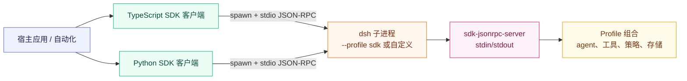

# Spike 0004：DeepSeek Harness SDK 能力源码调研

- **日期**：2026-09-07
- **调研对象**：`/Users/guan/git/deepseek-harness`
- **源码版本**：`d347e703908d0406b7a7ef80e3a0e594d86b2215`（`dsh-0.1.3-alpha.1` release merge）
- **方法**：只读源码与仓库一手文档；未发起模型请求、未安装依赖、未修改 dsh 源码、未执行真实运行时。
- **问题**：SDK 对外提供哪些能力，能支撑哪些产品场景，哪些能力属于 profile 而不是 SDK 本身，当前有哪些限制？

> [!IMPORTANT]
> **核心结论（事实）**：DSH 的外部 SDK 是一个“本机进程集成边界”，不是托管 HTTP API。TypeScript/Python 调用方启动一个完整的 `dsh --profile <name>` 子进程，通过 stdio 上按行分隔的 JSON-RPC 2.0 通信；agent、工具、凭据、持久化和安全策略由被选 profile 决定。依据：`/Users/guan/git/deepseek-harness/packages/sdk/README.zh.md:10-12`、`packages/sdk/client/src/launch.ts:128-156`、`python/sdk/src/deepseek_harness/client.py:458-486`。

---

## 1. 边界与术语

源码里有三个容易混淆的“SDK”概念：

| 名称 | 实际内容 | 主要消费者 | 证据 |
| :--- | :--- | :--- | :--- |
| 外部 Harness SDK | 从另一个进程启动并驱动 DSH runtime | 桌面应用、自动化、CI、编排器、另一个 Harness 进程 | `packages/sdk/README.zh.md:10-12` |
| SDK runtime server | Cordis 插件，把 runtime 映射为 stdio JSON-RPC 服务 | 被选中的 DSH profile | `packages/sdk/server/src/index.ts:20-101` |
| PTC 工具 SDK | 注入 agent 提示词、由 `run_code` 调用的 TypeScript/Python 声明 | DSH 内部的模型代码运行时，不是宿主程序 | `packages/core/tools/README.zh.md:123-125`、`packages/core/tools/src/ts-types.ts:249-316` |

本文把前两者称为**外部 SDK**；PTC 形式单独放在第 8 节，避免把给模型看的声明误认为可被桌面应用导入的 npm/Python API。



---

## 2. 发布面与协议层

### 2.1 包和模块地图

| 发布面 | 包 / 模块 | 对外职责 | 重要边界 |
| :--- | :--- | :--- | :--- |
| TypeScript 高/低层客户端 | `@deepseek-ai/dsh-sdk-client` | 管理 runtime 子进程；提供 `DeepSeekHarness`、`HarnessSession`、`HarnessClient` | 纯库，不向 Cordis context 注册插件 |
| 线协议 | `@deepseek-ai/dsh-sdk-protocol` | `JsonRpcLineTransport`、JSON-RPC 错误类、请求/通知类型 | 只处理调用方拥有的字节流，不组装 agent |
| runtime 服务插件 | `@deepseek-ai/dsh-sdk-jsonrpc-server` | 把协议请求映射到 session/agent | 依赖外围 profile 提供 `agents` 及其他 runtime 服务 |
| Python 高/低层客户端 | `deepseek-harness-sdk` / `deepseek_harness` | 同步版 `DeepSeekHarness`、`Session`、`HarnessClient`、配置/结果模型 | 依赖同版本平台 runtime wheel |
| Python runtime 载体 | `deepseek-harness-runtime-bin` / `deepseek_harness_runtime` | 定位打包后的 `dsh` 可执行程序和原生伴随文件 | 不是另一套 Python agent 实现 |
| Harness 内的隔离 subagent | `@deepseek-ai/dsh-subagent-dsh-sdk` | 用 TypeScript client 为每次委派启动一个全新的 DSH 子进程 | 是 Cordis provider，不是通用宿主 API |

根导出事实：TypeScript client 为 `packages/sdk/client/src/index.ts:12-30`，protocol 为 `packages/sdk/protocol/src/index.ts:11-27`，server 入口为 `packages/sdk/server/src/index.ts:18-46`，Python 根导出为 `python/sdk/src/deepseek_harness/__init__.py:1-19`，Python SDK 与 runtime 的依赖关系为 `python/sdk/pyproject.toml:5-16`。

### 2.2 JSON-RPC 方法

协议边界很小，只有三类请求和四类通知：

| 方向 | 方法 | 语义 |
| :--- | :--- | :--- |
| client → runtime | `initialize` | 选择 workspace `cwd`、provider、model、可选 `reasoningEffort` 和可选输出 token 上限 |
| client → runtime | `session/prompt` | 将内容排入具名 session，返回持久用户消息 ID |
| client → runtime | `shutdown` | 请求完整 runtime 关闭 |
| runtime → client | `session.event` | 推送持久 session-log 事件 |
| runtime → client | `session.status` | 推送 agent 整体的 `running` / `idle` 转换 |
| runtime → client | `subagent.started` | 推送子 session 的父子关系 |
| runtime → client | `subagent.finished` | 推送进程内 subagent 完成事件 |

类型和方法映射见 `packages/sdk/protocol/src/types.ts:15-118`；行分帧、请求/响应/通知分发和错误映射见 `packages/sdk/protocol/src/transport.ts:56-268`。

传输层按 UTF-8 行读取 JSON。格式错误的行会忽略；未知请求返回 `-32601`；处理器抛错返回 `-32603`；错误响应映射为 `JsonRpcResponseError`。`close()` 会移除监听器并拒绝挂起请求，但不会销毁调用方拥有的流。依据：`packages/sdk/protocol/src/transport.ts:56-61`、`201-268`。

---

## 3. 宿主程序可以做什么

### 3.1 运行一个由 profile 决定的 coding agent

**事实**：宿主可以指定 workspace、provider/model 路由、profile、有序 patch、环境变量和 token 上限，启动完整 DSH agent。高层 API 会在多次调用之间持有同一个子进程，并通过具名 session 继续对话。TypeScript 在 spawn 前解析路径，最终构造 `node <dsh-bin> --profile <profile> [--patch ...]`；Python 使用打包或调用方指定的 `dsh`，遵循同一 profile 语法。依据：`packages/sdk/client/src/types.ts:23-79`、`packages/sdk/client/src/launch.ts:128-156`、`python/sdk/src/deepseek_harness/api.py:49-131`、`python/sdk/src/deepseek_harness/client.py:458-486`。

```ts
import { DeepSeekHarness } from '@deepseek-ai/dsh-sdk-client'

await using harness = new DeepSeekHarness({
  dshHome: '/absolute/path/to/isolated-dsh-home',
  cwd: '/absolute/path/to/workspace',
  profile: 'sdk',
  provider: 'deepseek-official',
  model: 'deepseek-v4-flash',
  maxTokens: 49_152,
})

const result = await harness.run('检查仓库并总结失败的测试', {
  sessionId: 'diagnosis-001',
  onNotification: (notification) => {
    // 可在这里更新进度、审计记录或 subagent 状态。
  },
})
console.log(result.finalResponse)
```

调用形状来自一手示例 `packages/sdk/client/README.zh.md:30-48`；显式隔离 home 是产品侧建议，不是 TypeScript 构造器的强制字段。

**推断**：这适合 DSH Dock 提供“在指定 profile/workspace 中运行任务”的能力。桌面壳负责窗口、进程可见性和凭据策略，DSH 负责 agent loop 和工具组合；不应在壳里重写 DSH agent loop。

### 3.2 维护持久会话和隔离工作

**事实**：调用方可传入 `sessionId` 继续会话，省略时客户端生成新 ID；runtime 在首次 prompt 时惰性创建对应 agent/session。复用同一个 harness、home 和 ID 会延续持久对话与 session 资源；换用新的 home 才能隔离 profile、插件、凭据、设置和会话。依据：`packages/sdk/client/src/api.ts:97-115`、`packages/sdk/server/src/server.ts:259-291`、`python/sdk/README.zh.md:64-70`。

**推断**：桌面端可建立“一个任务页对应一个 session ID”的映射；对不应共享插件或凭据的任务，则使用新的 Harness home。

### 3.3 观察进度、事件和嵌套 agent

**事实**：高层 `run()` 先订阅，再排入 prompt；等待该消息出现在持久 `agent/inbox/spliced` 回执中；随后持续接收通知，直到根 session 下次进入 `idle`。结果包含根 session 事件，以及根和已发现后代的通知。后代关系由 `subagent.started` 边在客户端侧追踪。依据：`packages/sdk/client/src/api.ts:176-223`、`packages/sdk/client/src/client.ts:363-439`、`packages/sdk/protocol/src/types.ts:64-112`。

**重要语义限制（事实）**：`messageId` 只表示已排队的用户消息，不表示 assistant 消息、轮次结束或某个严格对应的 prompt 结果。高层 `finalResponse` 是本活动区间内根 session 的最后一条 assistant 文本，因此中途 steering、注入上下文或同一 session 的其他排队工作都可能参与其中。依据：`packages/sdk/protocol/README.zh.md:50-52`、`packages/sdk/client/README.zh.md:48-54`。

**推断**：GUI 可以准确展示运行状态和 subagent 生命周期，但应把结果命名为“session 活动区间结果”，不要承诺严格的一次 prompt 对应一次响应。

### 3.4 发送文本和内联图片

**事实**：prompt 支持普通 content block，以及带 base64 数据和 MIME 类型的 `image` block；允许的栅格 MIME 为 PNG、JPEG、WebP、GIF。服务端会先通过 profile 中的 attachment store 校验并接纳图片，再排入用户消息。依据：`packages/sdk/protocol/src/types.ts:35-53`、`packages/sdk/server/src/server.ts:35-52`。

```ts
const result = await harness.run([
  { type: 'text', text: '解释这张截图' },
  { type: 'image', data: imageBase64, mimeType: 'image/png' },
])
```

**推断**：桌面端可以直接实现截图辅助诊断、截图代码审查等流程，不必另造文件传输协议；前提是所选 profile 组合了可用的附件存储。

### 3.5 通过 profile 和 patch 定制 runtime

**事实**：SDK client 本身不定义工具。它只启动具名 profile 并传递有序 patch；profile 决定插件、凭据、存储、工具、persona 和策略。自定义 profile 必须包含 `@deepseek-ai/dsh-sdk-app` 或其他 JSON-RPC server 行。依据：`packages/sdk/client/src/launch.ts:128-156`、`python/sdk/README.zh.md:35-60`、`packages/bundle/sdk-app/README.zh.md:53-59`。

需要持久化依赖和 bundle 层时使用 `dsh plugin --profile <name> ...`；本地 `file:` bundle 可以安装到 profile 包树。已安装 Python SDK 的普通运行不需要系统 Node.js，但外部包管理仍需要 `pnpm`。依据：`python/sdk/README.zh.md:35-45`、`python/sdk-runtime/README.zh.md:26-30`。

**推断**：DSH Dock 的产品特化能力应优先放进独立版本化的 profile/bundle/patch，而不是硬编码进 SDK client 或 fork dsh 源码。

---

## 4. TypeScript 与 Python 调用面

### 4.1 TypeScript

| 层级 | 公开符号 | 能力 |
| :--- | :--- | :--- |
| 高层 | `DeepSeekHarness`、`HarnessSession` | `start()`、`session()`、`run()`、`close()`、`await using` 生命周期 |
| 低层 | `HarnessClient` | 显式 `start()`、`initialize()`、`prompt()`、原始 `request()`、通知订阅、`close()` |
| 错误 | `JsonRpcResponseError`、`RequestTimeoutError`、`SdkProtocolError`、`TransportClosedError` | 区分协议错误、调用方超时、wire 形状错误、子进程失败 |
| 类型 | launch 选项、`RunResult`、通知/过滤器/订阅类型、content block 类型 | 构建类型安全的宿主集成 |

导出见 `packages/sdk/client/src/index.ts:12-30`；高层生命周期见 `packages/sdk/client/src/api.ts:22-133`；低层客户端和订阅见 `packages/sdk/client/src/client.ts:176-410`。

默认初始化握手超时为 10 秒；普通请求默认不设超时，除非调用方配置；关闭时先发协议 `shutdown`，再走 stdin EOF，POSIX 继续 SIGTERM/SIGKILL，Windows 因 Node 的信号语义直接走强制终止。依据：`packages/sdk/client/src/launch.ts:11-12`、`packages/sdk/client/src/types.ts:43-52`、`packages/sdk/client/src/dispose.ts:70-99`。

### 4.2 Python

| 层级 | 公开符号 | 能力 |
| :--- | :--- | :--- |
| 高层 | `DeepSeekHarness`、`DeepSeekHarnessConfig`、`Session`、`RunResult` | 同步 API、上下文管理器、`run()` 或 `start_session(...).run()` |
| 低层 | `HarnessClient`、`HarnessConfig` | `initialize()`、`session_prompt()`、带模型校验的 `request()`、通知订阅、响应辅助方法 |
| 模型 | `Notification`、`IncomingRequest`、`InitializeResponse`、`ServerInfo`、`JsonObject` | 宿主侧事件和 JSON 信封类型 |
| 根导出的错误 | `SdkProtocolError` | 识别必需响应/事件的协议形状错误 |

根导出见 `python/sdk/src/deepseek_harness/__init__.py:1-19`；配置和结果字段见 `python/sdk/src/deepseek_harness/api.py:13-46`；通知订阅和 server-request 辅助接口见 `python/sdk/src/deepseek_harness/client.py:172-260`。

Python 的 `RunResult` 比 TypeScript 多一个 `finish_reason`，它取根 session 最后一条 `turn/end` 的 `reason.kind`；TypeScript 文档化的 `RunResult` 没有该字段。依据：`python/sdk/src/deepseek_harness/api.py:40-46`、`231-248`、`packages/sdk/client/src/types.ts:69-79`。

Python 要求显式非空 `dsh_home` 或 `DSH_HOME`，拒绝静默读取 `~/.dsh`；默认初始化超时为 30 秒。常规安装会解析同版本 runtime wheel，因此不需要系统 Node.js。依据：`python/sdk/src/deepseek_harness/client.py:458-486`、`python/sdk/src/deepseek_harness/api.py:22-37`、`python/sdk-runtime/README.zh.md:5-24`。

```python
from deepseek_harness import DeepSeekHarness

with DeepSeekHarness(
    dsh_home='/absolute/path/to/isolated-dsh-home',
    cwd='/absolute/path/to/workspace',
    profile='sdk-minimal',
    provider='deepseek-official',
    model='deepseek-v4-flash',
) as harness:
    result = harness.run('检查仓库并修复失败的测试', session_id='task-001')

print(result.final_response, result.finish_reason)
```

示例依据：`docs/user/guide/python-sdk.zh.md:81-106`。

### 4.3 源码与生成产物的注意点

**事实**：当前 TypeScript 源码的 client 根入口重新导出 `SdkPromptContentBlock`，protocol 源码也导出图片相关类型；但仓库内已生成的 `lib/types/index.d.ts` 没有完整列出这些导出。对照 `packages/sdk/client/src/index.ts:22-30` 与 `packages/sdk/client/lib/types/index.d.ts:13-20`，以及 `packages/sdk/protocol/src/index.ts:13-27` 与 `packages/sdk/protocol/lib/types/index.d.ts:12-15`。

**推断**：在产品依赖这些具体 TypeScript 类型之前，应针对目标版本检查实际 packed tarball/declaration。源码能证明当前意图，不能单独证明发布包的最终类型面。

---

## 5. Profile 决定实际 agent 能力

### 5.1 `sdk` profile

**事实**：`sdk` 在 `dsh-base` 上叠加 SDK 应用，设置 coding-agent persona，启动 JSON-RPC server，并禁用模型生成的 session title；stdout 专用于 JSON-RPC 帧。依据：`packages/bundle/sdk-app/README.zh.md:10-32`、`packages/bundle/sdk-app/cordis.patch.yml:1-21`。

需要完整 base 组合时选择它。它的确切工具清单仍由 profile/configuration 决定，不是 SDK client 的固定承诺。

### 5.2 `sdk-minimal` profile

**事实**：`sdk-minimal` 是独立完整的显式配置树，提供 Linux/macOS 持久 Bash 或 Windows PowerShell、`str_replace_editor`、本地执行、环境配置的 DeepSeek adapter 和未压缩 JSONL 会话；刻意省略 settings、托管凭据、telemetry、Web 工具、subagent、workspace 指令发现和 compaction。依据：`packages/bundle/sdk-minimal/README.zh.md:10-40`、`76-95`、`packages/bundle/sdk-minimal/cordis.patch.yml:5-168`。

> [!WARNING]
> **安全事实**：`sdk-minimal` 配置为 `danger-full-access`；其 shell 和 editor 可修改进程可见的任意路径。运行不可信任务时必须使用一次性 checkout 或容器。依据：`packages/bundle/sdk-minimal/cordis.patch.yml:41-45`、`docs/user/guide/python-sdk.zh.md:132-145`。

这也符合仓库安全声明：DSH 可执行模型生成的命令、加载第三方插件，并访问调用方提供的文件、凭据、进程和网络；它是 developer preview，不是独立安全边界。依据：`/Users/guan/git/deepseek-harness/SAFETY.md:7-23`。

---

## 6. 服务端集成与自定义客户端

### 6.1 在 profile 中嵌入 JSON-RPC server

**事实**：`@deepseek-ai/dsh-sdk-jsonrpc-server` 是 named Cordis plugin，`inject = ['agents']`。生产传输使用 `process.stdin`、`process.stdout`、`process.exit`；`input`、`output`、`exit` 仅是测试钩子。`initialize` 等待 Loader settle，校验 provider/model/effort 路由后才接受 prompt。依据：`packages/sdk/server/src/index.ts:20-101`、`packages/sdk/server/src/server.ts:130-193`。

server 会按 session ID 惰性创建 agent，把内联图片转成 durable attachment，转发 session/agent/subagent 生命周期事件，并在 shutdown 时释放自己持有的资源。依据：`packages/sdk/server/src/server.ts:35-52`、`89-127`、`176-236`、`259-295`。

### 6.2 实现其他语言客户端

**事实**：protocol 包提供可复用的按行 JSON-RPC transport 和具名 TypeScript 类型；Python 对侧独立复现 wire 结构，而不是导入 TypeScript。依据：`packages/sdk/protocol/src/index.ts:11-27`、`packages/sdk/protocol/src/transport.ts:56-268`、`packages/sdk/protocol/README.zh.md:114-124`。

**推断**：Go、Rust、Java 或桌面原生代码可以按该协议启动 `dsh --profile`，读写三类请求和四类通知，不必把 Node 嵌入调用方。但这会成为自行维护的新客户端；当前源码没有官方 Go/Rust/Java SDK。除非明确需要消除 Node/Python 依赖，否则优先复用已有 TypeScript/Python client。

---

## 7. 基于 SDK 的进程隔离 subagent

**事实**：`@deepseek-ai/dsh-subagent-dsh-sdk` 是 Harness 内的 provider，每次委派都启动一个全新的完整 DSH 子进程，再通过 TypeScript client 驱动；父级只收到最终/部分 assistant 输出和安全失败信息。子进程拥有自己的 profile、session 持久化、provider/model、工具，不继承父级对话。依据：`packages/subagent/subagent-dsh-sdk/src/index.ts:1-11`、`109-174`、`packages/subagent/subagent-dsh-sdk/src/run.ts:233-358`。

它只允许路由字段（`provider`、`model`、`reasoningEffort`、`maxTokens`）跨进程，不支持把 `outputSchema`、depth limit、tool filter、persona 传给子进程；父环境会先做凭据清理，再叠加显式 child env。依据：`packages/subagent/subagent-dsh-sdk/src/index.ts:109-138`、`packages/subagent/subagent-dsh-sdk/src/run.ts:54-71`、`239-254`。

**推断**：适合把高风险、长耗时或需要独立 profile 的 coding/research 工作委派出去；但每次都会加载完整插件树，且没有进程池，延迟和资源成本高于进程内 subagent。范围也仅支持本地子进程。依据：`packages/subagent/subagent-dsh-sdk/README.zh.md:165-175`。

---

## 8. 相邻能力：PTC 生成式工具 SDK

**事实**：`ptc` 模式下，模型只看到 `run_code` 加一段按语言生成的 TypeScript/Python 声明；代码用 `await tools.name(args)` 调工具，每次调用都会重新进入 DSH 完整的 guard/execute/result 流水线。`both` 同时暴露原生 schema 和 PTC，`native` 只暴露普通 function-call schema。依据：`packages/core/tools/README.zh.md:62-77`、`123-125`、`packages/core/tools/src/ts-types.ts:249-316`。

**边界（事实）**：这些声明是 prompt 文本，由模型代码运行时消费，不是桌面应用可 import 的 npm/Python 包。PTC 要求组合 `codeRuntime`，并注册对应语言的 SDK renderer。依据：`packages/core/agent-tool-presentation/README.zh.md:28-46`。

**推断**：如果目标是“让 DSH agent 在一段程序里编排多个工具并获得类型提示”，选择 PTC；如果目标是“让 DSH Dock/CI 驱动 DSH agent”，选择外部 SDK。两者控制面不同。

---

## 9. 限制与产品含义

| 限制（事实） | 证据 | 产品含义（推断） |
| :--- | :--- | :--- |
| 没有逐 prompt 取消或逐 session 关闭 RPC | `packages/sdk/protocol/README.zh.md:107-116`、`packages/sdk/server/README.zh.md:118-128` | 取消按钮实际要关闭 runtime/进程，不能宣称只取消一个排队 prompt。 |
| 没有严格的逐 prompt 结果关联 | `packages/sdk/protocol/README.zh.md:50-52`、`packages/sdk/client/README.zh.md:48-54` | 需要确定归因时应串行化同一 session；否则按活动区间展示。 |
| 没有协议版本协商 | `packages/sdk/protocol/README.zh.md:107-116` | 产品集成应锁定兼容的 client/runtime 版本，并自行做兼容检查。 |
| runtime 给 context 中所有 session 发通知，过滤由 client 完成 | `packages/sdk/protocol/src/types.ts:64-112`、`packages/sdk/client/src/client.ts:363-439` | 任务视图不能直接暴露未过滤的全局通知。 |
| `subagent.finished` 只报告进程内 child | `packages/sdk/server/src/server.ts:111-126` | UI 不能假设每个远程/隔离子进程都有该事件。 |
| stdout 只能放协议帧 | `packages/sdk/server/README.zh.md:42-45`、`packages/bundle/sdk-app/README.zh.md:53-59` | 诊断写 stderr；普通日志写 stdout 会破坏协议。 |
| TypeScript client 要求同版本 `@deepseek-ai/dsh` 或显式 `dshBin` | `packages/sdk/client/src/launch.ts:55-77`、`128-156` | 桌面发行版必须明确运行时的解析/打包策略。 |
| Python 要求 Python 3.10+ 和有限原生平台集合 | `python/sdk/pyproject.toml:5-16`、`docs/user/guide/python-sdk.zh.md:7-13`、`python/sdk-runtime/README.zh.md:5-24` | 安装器和支持流程要提前校验 OS/架构。 |
| 能力和安全姿态由 profile/configuration 决定 | `packages/sdk/server/README.zh.md:10-12`、`packages/bundle/sdk-minimal/README.zh.md:10-12` | 任意 profile/patch/plugin 都应视为信任边界，不能宣称 SDK 自带沙箱。 |

---

## 10. 对 DSH Dock 的建议用途

以下均为**基于源码事实的产品推断**，不是上游承诺：

1. **受管本地 agent runner**：以 profile/home/session 为维度创建任务页，展示通知和状态，并在关闭时可靠回收 runtime。
2. **Profile 级自动化**：为代码审查、诊断、仓库维护等任务提供受控 profile 和有序 patch，把产品策略放在 bundle，而不是 fork dsh。
3. **Session 监控与恢复**：把 Dock 任务 ID 映射到 DSH session ID，展示根响应、Python 侧的 finish reason 以及 child-agent 事件。
4. **截图辅助任务**：把用户图片转成允许的 base64 MIME block，交由 runtime 的 attachment store 持久化。
5. **隔离委派**：配置 `dsh-subagent-dsh-sdk` 使用独立 child profile/home，隔离父级对话与组合；同时向用户呈现 spawn 成本和本地限制。
6. **原生协议客户端（备选）**：只有在明确要去除 Node/Python 依赖时，才按 protocol 自行实现 Rust 侧 client，并承担 spawn、凭据、profile、关闭和版本兼容责任。

> [!NOTE]
> 本 Spike 不提出代码改动。DSH Dock 落地 SDK 功能前，先决定使用 TypeScript client、Python bundled runtime，还是新增原生 protocol client；这个选择会连带影响打包、引擎归属、凭据处理、取消语义和测试策略。

## 11. 验证状态

- [x] 阅读 SDK package manifest、入口源码、protocol 类型/transport、server、`sdk`/`sdk-minimal` profile、Python SDK/runtime、subagent provider 及一手 README/guide。
- [x] 所有关键事实均锚定到源码版本 `d347e703` 的文件路径和行号。
- [x] 已将源码事实与面向 DSH Dock 的产品推断分开。
- [ ] 未运行 live API/model/provisioning；真实运行时行为仍需后续专门验证。
